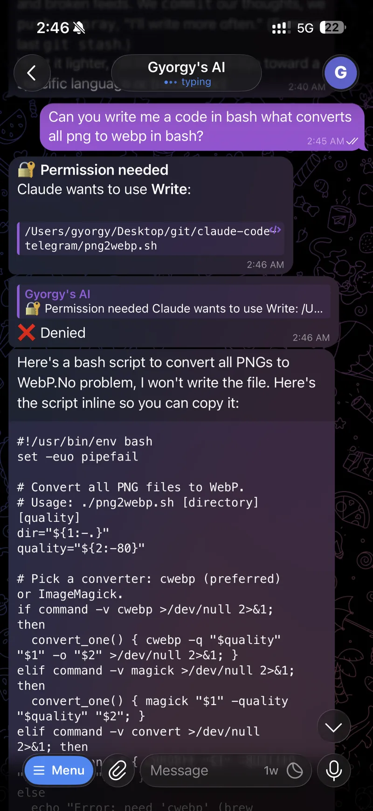

# claude-code-telegram

**A self-hosted AI operator for your machines — reach it over Telegram or the CCT Panel web dashboard.**

Open source. It puts a real **Claude Code** agent on your box and lets you drive it from your phone or a browser: check on services, restart things, read logs, edit a crontab, ship code, answer questions about the system — all in plain language, with the reply streaming back live and every risky action gated behind your approval.

It has grown well past a chat bot. It's a small **multi-agent platform**: a main agent you talk to, named **sub-agents** that run on a schedule or on demand, and a task board whose cards you can **delegate to an agent**. It runs on **cloud models** (Opus / Sonnet / Haiku) *or* your **own local LLMs** (LM Studio, Ollama) *or* any proxy — mix them freely. It **remembers what it learns** and recalls the relevant pieces into each conversation, so it adapts to you over time. And it's built in the open and improving fast — including self-updating itself.

> ⚠️ **This can read, write, and run commands on the machine it runs on.** Access is gated only by a Telegram user-id allow-list (and, for the panel, a secret token). Keep `ALLOWED_USER_IDS` tight and run it somewhere you control.

## Two ways in

The same agent, two front doors:

- **Telegram** — message a bot from your phone. The old loop for touching a server (open a terminal, SSH in, run something, close the session) becomes a chat with something already running on the box that knows the system. When a service falls over at 2am you get a ping and fix it from the couch, no SSH client required.
- **CCT Panel** — an optional web dashboard served by the *same process*: chat with the agent in the browser, watch live system health and model-backend status, run and schedule sub-agents, delegate task-board cards, browse and edit the agent's memory and skills, manage secrets, and tune proactive monitoring. See [CCT Panel](#cct-panel--the-web-dashboard).

Read the [full write-up →](https://gyorgy.sh/blog/claude-code-telegram).

## Where it's going

This is actively built in the open. The agent already **learns and adapts** — it writes durable memories, recalls them into future turns, and distils reusable skills on its own — and the platform keeps growing: richer memory, more connectors (Gmail, Calendar, Drive, Notion are stubbed in), deeper autonomy, and one-click panel updates are on the way. The aim is simple: the last operator you need to install on a box. Issues and PRs welcome.

## Screenshots

| | |
| --- | --- |
|  |  |
| Upload files & photos (Claude can *see* images), then drive the host — here approving a `Bash` call inline. | Replies stream back live as they're written, then land as a clean, formatted message. |
|  |  |
| Every non-read-only tool call pauses for **✅ Approve · ❌ Deny · ♾️ Always allow**. | Deny it and Claude adapts — here handing back the script inline instead of writing the file. |

## Features

- **Live streaming, the native way** — uses Telegram's streaming APIs: **Rich Messages** (Bot API 10.1) and **message drafts** (Bot API 9.3) so replies stream in as an animated preview and land as cleanly formatted, structured messages. A legacy edit-in-place mode is available as a fallback. See [Streaming modes](#streaming-modes).
- **CCT Panel — the web dashboard (optional)** — a full embedded UI with a left-sidebar layout: **chat with the agent** in the browser, live **system health**, a **model-backend status** page, **sub-agent workers**, a **task board** (with delegate-to-agent), a **skills** library, **durable memory**, a **secret vault**, **heartbeat** monitoring, schedules, sessions, usage, live logs and more. Off by default; token-gated; light / dark / hacker themes. See [CCT Panel](#cct-panel--the-web-dashboard).
- **Durable memory** — the agent remembers durable facts across conversations and recalls the relevant ones into each turn automatically (own `memory_*` tools; editable in the panel). It can also distil reusable workflows into the **skills** library itself.
- **Proactive monitoring** — an optional **heartbeat** watches host health (CPU/mem/swap/disk) and stalled task cards and pings you on Telegram when something's noteworthy — deterministic alerts, or an autonomous turn that investigates and acts.
- **Secret vault** — AES-256-GCM encrypted secrets with the master key in the macOS Keychain (file fallback on Linux); reference them as `vault:<id>` so provider tokens never sit in plaintext.
- **Permission-first** — nothing runs without your say-so. Read-only tools (Read/Glob/Grep…) run automatically; anything that touches the system (`Bash`/`Write`/`Edit`…) pauses for **✅ Approve · ❌ Deny · ♾️ Always allow** inline buttons. "Always allow" whitelists that tool for the rest of the session; approvals auto-deny on timeout so nothing hangs.
- **A capable, on-task personality** — smart, resourceful, and concise for a phone screen, with the occasional joke but work first, fun later. Tunable in `src/prompt.ts`.
- **Operator playbook (`work.md`)** — define how recurring jobs should be done ("restart Apache", crontab edits, deploys, schedules) once, and the bot follows your conventions every time. See [work.md](#workmd--your-operator-playbook).
- **Session continuity** — context carries across messages; `/new` resets it. Sessions (resume token, cwd, mode, allow-list, cost totals) are **persisted to disk**, so they survive a restart.
- **Git review from chat** — `/diff` shows the working-tree diff (as a `.diff` file when large) with inline **Commit / Discard** buttons; `/commit <message>` stages and commits.
- **Cost & usage tracking** — `/usage` reports turns, spend, and time for the chat (today + lifetime).
- **Voice notes** — send a voice message and it's transcribed and run as a prompt. Two backends via `TRANSCRIBE_PROVIDER`: an OpenAI-compatible API (OpenAI, or Groq's free tier), or fully local **Vosk** (offline, English, needs `ffmpeg`).
- **Scheduled prompts** — `/schedule add 2h | check disk space` runs a prompt on a timer (interval or daily), autonomously, and pushes the result back to the chat.
- **Multi-project switching** — `/projects` saves working dirs and switches between them with inline buttons.
- **Persistent approval presets** — “Always allow” remembers a tool (or a specific Bash program like `git`) across restarts; manage with `/allow`, `/allowed`, `/disallow`. A middle ground between fully interactive `safe` and hands-off `auto`.
- **Working directory control** — `/cd`, `/pwd`, `/status`.
- **File send/receive** — upload files/photos (Claude *sees* images inline); Claude can send files back via a built-in `send_file` tool (images arrive as photos).
- **Quiet by default** — messages from anyone not on the allow-list are silently ignored (no reply, no trace).

## Platforms

Runs anywhere Node.js 20+ runs — **Linux**, **macOS**, and **Windows** — using the npm scripts (`npm install`, `npm run dev` / `npm run build && npm start`).

Authentication for Claude itself reuses your existing `claude` CLI login, or set `ANTHROPIC_API_KEY` in `.env`. Uses long polling, so no public webhook or open port is needed.

## Quick install (one-liner)

On a fresh **Linux** or **macOS** box, the wizard installs everything for you — Homebrew (macOS), Node 20+, git, and the Claude Code CLI — checks RAM (and offers to add swap on small Linux boxes), clones the repo, builds it, walks you through `.env`, optionally sets up voice transcription (cloud API or local Vosk + ffmpeg, model downloaded for you), and offers to run as a background service:

```bash
curl -fsSL https://gyorgy.sh/cct-install.sh | bash
```

You'll still need a [bot token](#setup) and your numeric user id to hand it (it prompts for both). Prefer to read before you run? The script is [`scripts/cct-install.sh`](scripts/cct-install.sh).

> The wizard is interactive — it reads your answers from the terminal even when piped through `curl`. For an unattended run, set `CCT_TOKEN`, `CCT_USER_IDS`, and `CCT_MODE=service|manual` (and `CCT_YES=1`) in the environment.

## Setup (manual)

1. **Create a bot**: message [@BotFather](https://t.me/BotFather), run `/newbot`, copy the token.
2. **Find your user id**: message [@userinfobot](https://t.me/userinfobot).
3. **Configure**:
   ```bash
   cp .env.example .env
   # edit .env: TELEGRAM_BOT_TOKEN, ALLOWED_USER_IDS, WORKDIR
   ```
4. **Install & run**:
   ```bash
   npm install
   npm run dev         # watch mode (reloads on change)
   # or: npm run build && npm start
   ```

## Run as a service (Linux & macOS)

For an always-on deployment, install the bot as an OS service. The same commands work on both platforms — they dispatch to **systemd** on Linux and **launchd** on macOS:

```bash
./scripts/install-service.sh        # builds, installs + starts the service
./scripts/agentctl.sh status        # start | stop | restart | status | logs
./scripts/agentctl.sh logs          # follow logs
```

- **Linux** — a systemd unit (`telegram-agent`). The installer also adds a scoped, passwordless sudoers rule for just this service.
- **macOS** — a per-user LaunchAgent (`sh.gyorgy.telegram-agent`) that runs in your login session (where the `claude` CLI login lives); no sudo needed.

Either way you can **ask the agent to restart itself** ("restart yourself" → `./scripts/agentctl.sh restart`); the management commands are documented in `work.md`. The launcher `scripts/run.sh` can also be run directly without any service manager.

### Update & uninstall

```bash
./scripts/update.sh                 # git pull + npm install + build, restarts the service if installed
./scripts/uninstall-service.sh      # remove the service (leaves the checkout, .env and data/ intact)
```

`update.sh` refuses to run with uncommitted changes and only restarts when a service is actually installed, so it's safe whether you run as a service or by hand.

```
scripts/
  cct-install.sh         # one-liner bootstrap wizard (curl | bash)
  run.sh                 # launcher (build if needed, then run)
  update.sh              # pull + rebuild + restart
  install-service.sh     # installer    → dispatches by OS
  uninstall-service.sh   # uninstaller  → dispatches by OS
  agentctl.sh            # manager       → dispatches by OS
  linux/                 # systemd implementation
  macos/                 # launchd implementation
```

## Configuration

| Variable | Required | Description |
| --- | --- | --- |
| `TELEGRAM_BOT_TOKEN` | yes | Token from @BotFather |
| `ALLOWED_USER_IDS` | yes | Comma-separated numeric Telegram user ids (the allow-list) |
| `WORKDIR` | no | Directory Claude starts in (default: the gitignored `data/` folder, so agent-created files stay out of the repo) |
| `STATE_FILE` | no | Where session + usage state is persisted across restarts (default `data/state.json`) |
| `CLAUDE_MODEL` | no | Model id (default `claude-opus-4-8`) |
| `ANTHROPIC_API_KEY` | no | API key; omit to use `claude` CLI login |
| `APPROVAL_TIMEOUT_MS` | no | Approval wait before auto-deny (default 300000) |
| `STREAM_MODE` | no | `rich` (default), `draft`, or `edit` — see below |
| `TRANSCRIBE_PROVIDER` | no | Voice backend: `openai` (default) or `vosk` (local) |
| `OPENAI_API_KEY` | no | API key for the `openai` voice backend (OpenAI, Groq, …) |
| `TRANSCRIBE_MODEL` | no | Transcription model for `openai` (default `whisper-1`) |
| `TRANSCRIBE_BASE_URL` | no | OpenAI-compatible base URL (default `https://api.openai.com/v1`) |
| `VOSK_MODEL_PATH` | no | Path to an unpacked Vosk model dir (enables the `vosk` backend) |
| `FFMPEG_PATH` | no | ffmpeg binary used to decode voice notes for Vosk (default `ffmpeg`) |
| `LOG_LEVEL` | no | `error` \| `warn` \| `info` (default) \| `debug` |
| `WORK_FILE` | no | Path to the operator playbook (default `work.md`) |
| `PANEL_ENABLED` | no | `true` to start the CCT Panel web dashboard (default `false`) |
| `PANEL_TOKEN` | when panel on | Shared secret required on every panel request/WS — startup fails if the panel is enabled without it |
| `PANEL_HOST` | no | Bind address (default `127.0.0.1` — loopback) |
| `PANEL_PORT` | no | Port (default `8787`) |
| `PANEL_CHAT_ENABLED` | no | `false` to hide the panel Chat view and disable its endpoints (default `true`) |
| `PANEL_CHAT_BYPASS` | no | `true` to unlock the Chat's auto (no-approval) mode; otherwise risky tools prompt for approval in the panel (default `false`) |

### Streaming modes

| Mode | How it streams | Notes |
| --- | --- | --- |
| `rich` | Bot API 10.1 Rich Messages (`sendRichMessageDraft` → `sendRichMessage`) | Default. Structured formatting; sent as safe escaped HTML so code (`<…>`, `#`, `$`) never breaks the parser. Private chats only. |
| `draft` | Bot API 9.3 `sendMessageDraft` → `sendMessage` | Plain animated preview, finalized as a formatted message. Private chats only. |
| `edit` | Throttled `editMessageText` of a placeholder | Most battle-tested fallback; works in any chat. |

### Voice transcription

Send a voice note and it's transcribed, then run like a typed prompt. Choose a backend with `TRANSCRIBE_PROVIDER`:

- **`openai`** (default) — any OpenAI-compatible `/audio/transcriptions` host. Use OpenAI directly, or **Groq's free tier** by setting `TRANSCRIBE_BASE_URL=https://api.groq.com/openai/v1`, `TRANSCRIBE_MODEL=whisper-large-v3-turbo`, and `OPENAI_API_KEY` to a Groq key.
- **`vosk`** — fully local and offline, no API. One-time setup:
  ```bash
  npm install vosk                 # optional native dependency
  # install ffmpeg via your package manager (brew/apt/…)
  # download + unpack a model from https://alphacephei.com/vosk/models
  #   e.g. vosk-model-small-en-us-0.15 (~40MB)
  ```
  Then set `VOSK_MODEL_PATH=/path/to/vosk-model-small-en-us-0.15` and `TRANSCRIBE_PROVIDER=vosk`. ffmpeg decodes Telegram's OGG/Opus to the 16kHz PCM Vosk expects. The small English model is fast on a CPU; larger models trade speed for accuracy.

## CCT Panel — the web dashboard

**CCT Panel** is the optional web dashboard, served **in the same process** as the bot (no extra service), for driving and managing everything from a browser. It's **off by default** because it can read host data and launch autonomous agents — the same reach as the bot itself.

Enable it in `.env`:

```bash
PANEL_ENABLED=true
PANEL_TOKEN=choose-a-long-random-secret   # required; startup fails without it
# PANEL_HOST=127.0.0.1   # loopback by default
# PANEL_PORT=8787
```

Then build the panel UI and start as usual:

```bash
npm run build      # builds the panel, then the bot (or: npm run build:panel)
npm start
# dev: npm run dev  — runs the bot AND rebuilds the panel on change (served
#                     together at the same URL, never stale)
#      panel HMR:   npm run panel:dev (Vite dev server with hot reload, proxies the API)
```

Open `http://127.0.0.1:8787` and unlock with your `PANEL_TOKEN`. It's a left-sidebar dashboard grouped into **Monitor**, **Operate**, **Configure** and **Others**, with light / dark / hacker themes and a URL per view (so a refresh reloads the same page). What's inside:

- **Chat** — talk to the agent right in the browser. It's a dedicated, persistent Claude session (separate from Telegram) that streams live; risky tools pause for **Approve / Deny** in the panel, unless you unlock an auto (no-prompt) mode via `PANEL_CHAT_BYPASS`. Disable the whole view with `PANEL_CHAT_ENABLED=false`.
- **System** — live CPU (overall + per-core), memory, swap, disk usage and disk I/O, pushed over a WebSocket.
- **Status** — the public Claude service status (no API key needed) plus reachability, auth and model lists for each configured provider and any running local backend (LM Studio / Ollama).
- **Agents** — configure both the **main agent** and **sub-agent workers** on one page:
  - **Main agent** (drives your Telegram chats): switch its **model** (Opus/Sonnet/Haiku or a local model) and **provider** at runtime — changes apply on the next message. Plus **New context** (abort any running turn and clear conversation history) and **Restart service** (full respawn, when running under systemd/launchd).
  - **Workers** — persisted **sub-agents**: name, working directory, task prompt, model, optional persona/skill, and an optional schedule (`30m`/`2h`/`HH:MM`). Run on demand or on the timer; runs are **concurrent** and autonomous (no approval prompts), with **live streaming output** and per-worker run history (status, cost, duration). Picking Haiku makes cheap background agents practical.
  - **Local models** — define a **provider** (an Anthropic-compatible base URL + auth token, e.g. **LM Studio** `http://localhost:1234` or **Ollama**) with one-click presets, and **fetch its model list** with a button. Point the main agent or any worker at it with a free-text model name (`qwen/qwen3.6-35b-a3b`, …), so you can mix cloud and local freely. (You can also run the whole bot on a local model from `.env` via `ANTHROPIC_BASE_URL` + `ANTHROPIC_AUTH_TOKEN`.)
- **Tasks** — a board (Backlog / In progress / Done) with drag-and-drop, priority, WIP limits, card aging, and **delegate-to-agent**: hand a card to an autonomous run that streams progress and moves it to Done (and can break it into subtasks).
- **Schedules** — create, view and delete timed autonomous prompts (the same jobs as `/schedule`).
- **Heartbeat** — proactive monitoring: pick **off / alert / active**, set health thresholds and the stalled-card window, see recent alerts, or run a check now.
- **Skills** — a reusable **prompt library** (the agent can add to it itself), plus a scoped editor for the on-disk `.claude/{agents,skills,commands}/*.md` and `CLAUDE.md` files the agent loads from your working dirs.
- **Memory** — browse, search, edit and delete the durable facts the agent has learned.
- **Vault** — AES-256-GCM encrypted secrets; reveal/edit, and **scan & import** to move plaintext provider tokens onto `vault:<id>` references.
- **Connectors** — placeholders for Gmail / Google Calendar / Drive / Notion (registration surface + vault-backed credential slot; not wired up yet).
- **Prompt** — view the built-in personality and edit the operator playbook (`work.md`) live.
- **Logs** — a live tail of the bot's activity (turns, tool calls, errors, worker lifecycle), streamed over the WebSocket with level filters. (The agent runs headless via the SDK — there's no terminal to attach to — so this is the "remote view".)
- **Sessions / Usage / Updates** — live session state, cost/usage charts, and current version.

Every request and WebSocket handshake requires the token (sent as a `Bearer` header / `?token=`), and write actions are recorded to an audit log (`data/audit.jsonl`). Keep the bind on loopback and reach it remotely only behind a reverse proxy or a private network (e.g. Tailscale) — never expose it raw.

## Permissions

The bot never runs commands on its own. For every non-read-only tool call you get an inline prompt showing exactly what Claude wants to do:

- **✅ Approve** — run it once.
- **❌ Deny** — refuse it.
- **♾️ Always allow `<Tool>`** — stop asking for that tool for the rest of this session (until `/new` or a restart).

To run without prompts entirely, switch a chat to autonomous mode with `/mode auto` (and back with `/mode safe`). Read-only tools always run automatically.

## work.md — your operator playbook

`work.md` is a plain-markdown file the bot appends to Claude's system prompt **on every turn** (so edits apply instantly, no restart). Use it to define how common, recurring tasks should be done so they happen the same way each time — for example:

- "restart Apache" → the exact command and a config test first
- editing **crontab** safely (diff, back up, non-interactive install) and scheduling jobs
- deploy steps for your projects
- ground rules (confirm destructive actions, prefer non-interactive commands)

A starter template ships in `work.md`; replace the examples with what's true for your machine. Point `WORK_FILE` elsewhere to use a different file.

## Commands

| Command | Action |
| --- | --- |
| `/new` | Start a fresh conversation |
| `/cd <path>` | Change working directory |
| `/pwd` | Show current directory |
| `/status` | Show session info (cwd, model, mode, session id) |
| `/projects` | Saved working dirs; switch/add/remove via inline buttons |
| `/diff` | Review the working-tree diff, then commit or discard inline |
| `/commit <message>` | Stage all changes and commit |
| `/usage` | Show cost & activity for this chat (today + lifetime) |
| `/allow <Tool>` · `/allowed` · `/disallow <Tool\|all>` | Manage persistent always-allow rules |
| `/schedule [list]` · `/schedule add <when> \| <prompt>` · `/schedule rm <id>` | Timed autonomous prompts (`when` = `30m`/`2h`/`1d` or `HH:MM`) |
| `/stop` | Abort the running request |
| `/mode safe\|auto` | Interactive approval (default) or autonomous |
| `/help` | Show help |

You can also send a **voice note** (transcribed and run as a prompt) or upload **files/photos** (Claude sees images inline).

## Architecture

```
src/
  index.ts            entry: load config, build bot, set commands, launch
  config.ts           env parse + validation (zod)
  auth.ts             allow-list middleware (silently drops non-admins)
  logger.ts           tiny timestamped structured logger (LOG_LEVEL)
  prompt.ts           personality + work.md -> system prompt (per turn)
  bot.ts              Telegraf wiring + per-turn orchestration
  commands.ts         /new /cd /pwd /status /projects /diff /commit /usage /allow /schedule /stop /mode /help
  git.ts              shell-free git helpers (status, diff, commit, restore)
  session/
    manager.ts        per-chat state (sessionId, cwd, busy, mode, allow-lists, projects, usage)
    store.ts          JSON persistence of session + usage state across restarts
  schedule/
    manager.ts        schedule parsing, next-run math, tick loop running autonomous turns
    store.ts          JSON persistence of schedules (sibling of the state file)
  claude/
    runner.ts         wraps the Agent SDK query(); fans events to callbacks; inline image vision
    events.ts         narrow type guards over SDK messages
  core/               telegraf-free layer shared by the bot and the panel
    health.ts         system-health snapshot (CPU/mem/swap/disk/IO)
    status.ts         public Claude status + provider/local-backend probes
    snapshot.ts       read-only session/usage views
    chat.ts           the panel's dedicated Claude chat session
    memory.ts         durable fact store (memory.json) recalled into each turn
    vault.ts          AES-256-GCM secrets (keychain/file master key)
    heartbeat.ts      proactive host/kanban monitoring loop
    connectors.ts     external-connector catalog (placeholders)
    playbook.ts       read/write the operator playbook (work.md)
    skills.ts         reusable prompt library (skills.json)
    claudeFiles.ts    scoped browser/editor for on-disk .claude/* + CLAUDE.md
    tasks.ts          task board store (tasks.json) · taskRunner.ts  delegate-to-agent
    workers.ts        persisted sub-agents: registry + concurrent run manager
    providers.ts      local/proxy model-endpoint presets · providerModels.ts  model listing
    mainSettings.ts   main-agent model/provider override · agentControl.ts  service restart
    jsonStore.ts      atomic JSON store helper · audit.ts  append-only audit log
  panel/              CCT Panel backend (optional, PANEL_ENABLED)
    server.ts         in-process Fastify: token auth, REST API, static SPA
    hub.ts            WebSocket fan-out (worker/chat/task events + health/log push)
  mcp/
    sendFile.ts       send a file back to the Telegram chat
    memory.ts         memory_write/search/list · tasks.ts  task_create/list/update
    skills.ts         skill_save/patch/list (the "skill factory")
  telegram/
    streamer.ts          edit-in-place streaming backend ("edit")
    baseDraftStreamer.ts  shared draft machinery (throttle + keepalive)
    draftStreamer.ts      Bot API 9.3 sendMessageDraft backend ("draft")
    richDraftStreamer.ts  Bot API 10.1 Rich Messages backend ("rich")
    send.ts            shared final-message sender (markdown -> HTML, splitting)
    formatting.ts      markdown -> Telegram HTML (headings, bold, code, quotes)
    permissions.ts     approval keyboards (incl. per-Bash-command preset) + registry
    gitFlow.ts         /diff rendering + commit/discard buttons + callbacks
    projects.ts        /projects switch menu + callbacks
    voice.ts           voice-note transcription dispatcher (openai | vosk)
    vosk.ts            local offline transcription (ffmpeg decode + Vosk)
    files.ts           incoming file downloads + image decoding for vision

panel/                CCT Panel frontend (React + Vite + Tailwind),
                      built to panel/dist and served by src/panel/server.ts
```

Built on [`telegraf`](https://github.com/telegraf/telegraf) and [`@anthropic-ai/claude-agent-sdk`](https://www.npmjs.com/package/@anthropic-ai/claude-agent-sdk); the optional panel uses [`fastify`](https://fastify.dev) + [`systeminformation`](https://systeminformation.io) on the server and React + Vite + Tailwind on the client.

## Support & troubleshooting

- **Bot doesn't respond at all** — confirm your numeric id is in `ALLOWED_USER_IDS`; unknown users are ignored silently. Check the console logs (raise detail with `LOG_LEVEL=debug`).
- **`npm start` shows stale behavior** — `npm start` runs the compiled `dist/`; rebuild with `npm run build` first.
- **Rich formatting looks off** — try `STREAM_MODE=draft` or `STREAM_MODE=edit` in `.env`. Rich/draft modes require a **private** chat.
- **Approvals never resolve** — make sure only **one** instance is polling; two pollers split updates and cause conflicts.

## Credits

Created by **Gyorgy** — [gyorgy.sh](https://gyorgy.sh) · [github.com/gyorgysh](https://github.com/gyorgysh).

> 🤖 **Fun fact:** this project was built hand-in-hand with Claude — which is fitting, since the whole thing exists to put Claude Code in your pocket. Claude helped write the bot that lets you talk to Claude. Turtles all the way down.

## License

MIT
