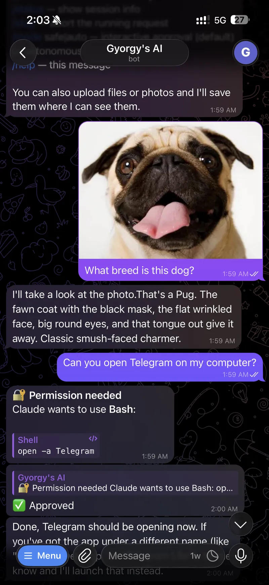
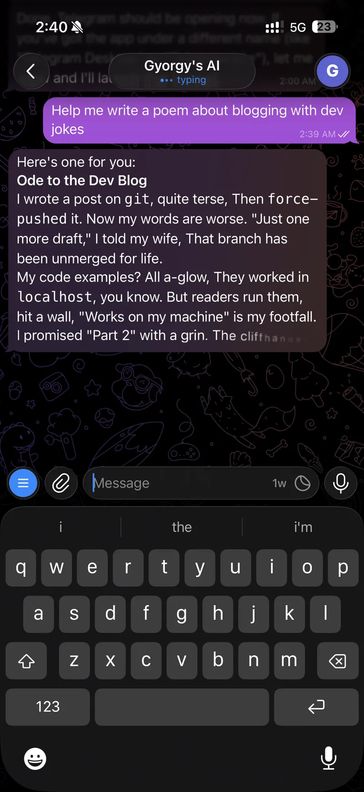
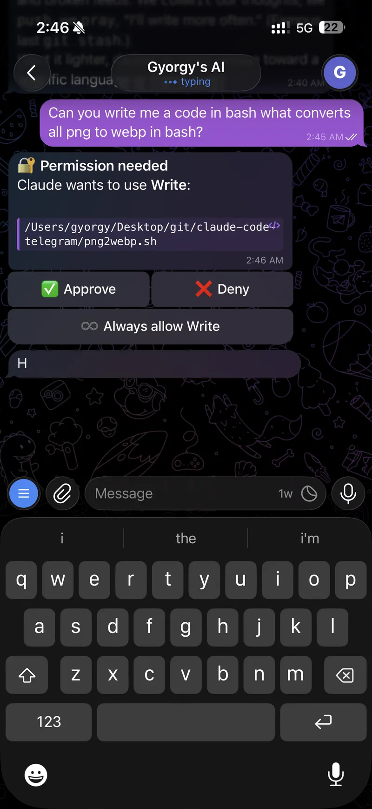
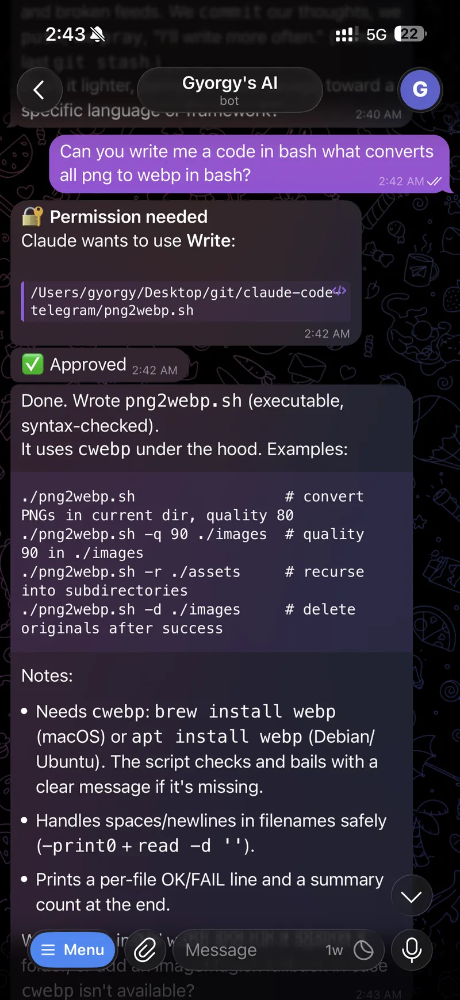

# CCT Panel · claude-code-telegram

**A self-hosted AI operator for your machines.** Reach it from your phone over Telegram, or from a browser through the CCT Panel: a web dashboard with live system health, sub-agents, a task board, durable memory, and an encrypted secret vault, all served by the same process.


Open source. It puts a real **Claude Code** agent on your machine and lets you drive it in plain language: check on services, restart things, read logs, edit a crontab, ship code — with replies streaming back live and every risky action gated behind your approval.

It has grown well past a chat bot. The same agent you talk to over Telegram powers named **sub-agents** that run on a schedule or on demand, a **task board** whose cards you can delegate to an autonomous run, and a **memory** that recalls the relevant facts into every conversation so it adapts to you over time. It runs on cloud models (Opus / Sonnet / Haiku) *or* your own local LLMs (LM Studio, Ollama), switchable live from the panel.

> ⚠️ **This can read, write, and run commands on the machine it runs on.** Access is gated only by a Telegram user-id allow-list (and, for the panel, a secret token). Keep `ALLOWED_USER_IDS` tight and run it somewhere you control.

Read the [full write-up →](https://gyorgy.sh/blog/claude-code-telegram)

## Two ways in

The same agent, two front doors:

- **Telegram**: message a bot from your phone. The old loop for touching a server (open a terminal, SSH in, run something, close) becomes a chat with something already living on the server that knows the system. When a service falls over at 2 am you get a ping and fix it from the couch, no SSH client required.
- **CCT Panel**: an optional web dashboard served by the same process. Chat with the agent in the browser, watch live system health and backend status, run and schedule sub-agents, delegate task-board cards, browse memory and skills, manage secrets, and tune proactive monitoring.

## CCT Panel — the web dashboard

| | |
| --- | --- |
|  |  |
| **Agents**: switch the main agent's model live; create named **workers** with their own model, persona, skill, and optional schedule — runs are concurrent and stream output live. | **Tasks**: a Kanban board (Backlog / In progress / Done) with drag-and-drop, priority, WIP limits, and a **Delegate** button that hands a card to an autonomous agent run. |
|  |  |
| **Heartbeat**: proactive monitoring. Set CPU/mem/swap/disk thresholds and a stalled-card window; the bot pings Telegram on breach, or runs an autonomous turn to investigate and act first. | **Schedules**: create timed autonomous prompts (`30m`, `2h`, `HH:MM`) from the panel or via `/schedule` in chat — results push back to Telegram. |

Also inside: **System** (live CPU per-core, memory, swap, disk I/O), **Status** (Claude service status + provider/local-backend probes), **Memory** (browse / search / edit), **Vault** (AES-256-GCM secrets), **Skills**, **Prompt** (playbook editor), **Logs** (live tail), and more.

## In Telegram

| | |
| --- | --- |
|  |  |
| Upload files and photos — Claude *sees* images inline. Here it approves a `Bash` call directly from the chat. | Replies stream back live as they're written using Telegram's Rich Messages API, then land as a clean, formatted message. |
|  |  |
| Tap **✅ Approve**, **❌ Deny**, or **♾️ Always allow** — the last option whitelists the tool for the rest of the session. | Every non-read-only tool call pauses the run and posts the exact command for review. |

## Quick install

On a fresh **Linux** or **macOS** machine, the wizard installs everything (Homebrew on macOS, Node 20+, git, and the Claude Code CLI), checks RAM, clones the repo, builds it, walks you through `.env`, optionally sets up voice transcription, and offers to run as a background service:

```bash
curl -fsSL https://gyorgy.sh/cct-install.sh | bash
```

You'll need a [bot token](#setup) and your numeric Telegram user id on hand — the wizard prompts for both. Prefer to read before you run? The script is [`scripts/cct-install.sh`](scripts/cct-install.sh).

> The wizard is interactive and reads your answers from the terminal even when piped through `curl`. For an unattended run, set `CCT_TOKEN`, `CCT_USER_IDS`, and `CCT_MODE=service|manual` (and `CCT_YES=1`) in the environment.

## Setup (manual)

> This is the advanced path: no background services or OS-level workers are installed. That's fine for testing and running the bot in your terminal — full functionality is available. You can always install it as a service later, or uninstall cleanly, without touching your checkout or data.

1. **Create a bot**: message [@BotFather](https://t.me/BotFather), run `/newbot`, copy the token.
2. **Find your user id**: message [@userinfobot](https://t.me/userinfobot).
3. **Configure**:
   ```bash
   cp .env.example .env
   # edit .env: TELEGRAM_BOT_TOKEN, ALLOWED_USER_IDS, WORKDIR
   ```
4. **Install & run**:
   ```bash
   npm install
   npm run dev         # watch mode (reloads on change)
   # or: npm run build && npm start
   ```

## Run as a service (Linux & macOS)

```bash
./scripts/install-service.sh        # builds, installs + starts the service
./scripts/agentctl.sh status        # start | stop | restart | status | logs
./scripts/agentctl.sh logs          # follow logs
```

- **Linux**: a systemd unit (`telegram-agent`). The installer adds a scoped, passwordless sudoers rule for this service.
- **macOS**: a per-user LaunchAgent (`sh.gyorgy.telegram-agent`) that runs in your login session (where the `claude` CLI login lives); no sudo needed.

You can also **ask the agent to restart itself** ("restart yourself" → `./scripts/agentctl.sh restart`).

### Update & uninstall

```bash
./scripts/update.sh                 # git pull + npm install + build, restarts if a service is installed
./scripts/uninstall-service.sh      # remove the service (leaves the checkout, .env and data/ intact)
```

```
scripts/
  cct-install.sh         # one-liner bootstrap wizard (curl | bash)
  run.sh                 # launcher (build if needed, then run)
  update.sh              # pull + rebuild + restart
  install-service.sh     # installer    -> dispatches by OS
  uninstall-service.sh   # uninstaller  -> dispatches by OS
  agentctl.sh            # manager      -> dispatches by OS
  linux/                 # systemd implementation
  macos/                 # launchd implementation
```

## Configuration

| Variable | Required | Description |
| --- | --- | --- |
| `TELEGRAM_BOT_TOKEN` | yes | Token from @BotFather |
| `ALLOWED_USER_IDS` | yes | Comma-separated numeric Telegram user ids (the allow-list) |
| `WORKDIR` | no | Directory Claude starts in (default: `data/`) |
| `STATE_FILE` | no | Session + usage persistence path (default `data/state.json`) |
| `CLAUDE_MODEL` | no | Model id (default `claude-opus-4-8`) |
| `ANTHROPIC_API_KEY` | no | API key; omit to use `claude` CLI login |
| `APPROVAL_TIMEOUT_MS` | no | Approval wait before auto-deny (default 300000) |
| `STREAM_MODE` | no | `rich` (default), `draft`, or `edit` |
| `TRANSCRIBE_PROVIDER` | no | Voice backend: `openai` (default) or `vosk` (local) |
| `OPENAI_API_KEY` | no | API key for the `openai` voice backend (OpenAI, Groq, …) |
| `TRANSCRIBE_MODEL` | no | Transcription model (default `whisper-1`) |
| `TRANSCRIBE_BASE_URL` | no | OpenAI-compatible base URL (default `https://api.openai.com/v1`) |
| `VOSK_MODEL_PATH` | no | Path to an unpacked Vosk model dir (enables the `vosk` backend) |
| `FFMPEG_PATH` | no | ffmpeg binary for voice note decoding (default `ffmpeg`) |
| `LOG_LEVEL` | no | `error` \| `warn` \| `info` (default) \| `debug` |
| `WORK_FILE` | no | Path to the operator playbook (default `work.md`) |
| `PANEL_ENABLED` | no | `true` to start the CCT Panel (default `false`) |
| `PANEL_TOKEN` | when panel on | Shared secret for all panel requests; startup fails without it |
| `PANEL_HOST` | no | Bind address (default `127.0.0.1`) |
| `PANEL_PORT` | no | Port (default `8787`) |
| `PANEL_CHAT_ENABLED` | no | `false` to hide the panel Chat view (default `true`) |
| `PANEL_CHAT_BYPASS` | no | `true` to unlock the Chat's auto (no-approval) mode (default `false`) |

### Streaming modes

| Mode | How it streams | Notes |
| --- | --- | --- |
| `rich` | Bot API 10.1 Rich Messages (`sendRichMessageDraft` → `sendRichMessage`) | Default. Structured formatting. Private chats only. |
| `draft` | Bot API 9.3 `sendMessageDraft` → `sendMessage` | Plain animated preview, finalized as a formatted message. Private chats only. |
| `edit` | Throttled `editMessageText` of a placeholder | Most battle-tested fallback; works in any chat. |

### Voice transcription

Send a voice note and it's transcribed and run like a typed prompt. Two backends via `TRANSCRIBE_PROVIDER`:

- **`openai`** (default): any OpenAI-compatible `/audio/transcriptions` host. Use OpenAI directly, or **Groq's free tier** by setting `TRANSCRIBE_BASE_URL=https://api.groq.com/openai/v1`, `TRANSCRIBE_MODEL=whisper-large-v3-turbo`, and a Groq `OPENAI_API_KEY`.
- **`vosk`**: fully local and offline, no API key needed.
  ```bash
  npm install vosk
  # install ffmpeg, download + unpack a model from https://alphacephei.com/vosk/models
  ```
  Then set `VOSK_MODEL_PATH=/path/to/vosk-model` and `TRANSCRIBE_PROVIDER=vosk`.

## CCT Panel — enabling it

**CCT Panel** is served **in the same process** as the bot (no extra service). Off by default because it has the same reach as the bot.

```bash
PANEL_ENABLED=true
PANEL_TOKEN=choose-a-long-random-secret   # required; startup fails without it
# PANEL_HOST=127.0.0.1
# PANEL_PORT=8787
```

```bash
npm run build && npm start
# dev: npm run dev   (bot + panel rebuild together, never stale)
```

Open `http://127.0.0.1:8787` and unlock with your `PANEL_TOKEN`. Left-sidebar navigation grouped into **Monitor**, **Operate**, **Configure**, and **Others** — light / dark / hacker themes, URL per view. Keep the bind on loopback and reach it only behind a reverse proxy or private network (e.g. Tailscale).

Full panel reference in the [write-up](https://gyorgy.sh/blog/claude-code-telegram).

## Permissions

Nothing runs without your say-so. For every non-read-only tool call you get an inline prompt showing exactly what Claude wants to do:

- **✅ Approve** — run it once.
- **❌ Deny** — refuse it.
- **♾️ Always allow `<Tool>`** — stop asking for that tool for the rest of this session.

To skip prompts entirely, switch a chat to autonomous mode with `/mode auto` (and back with `/mode safe`). Read-only tools (`Read`/`Glob`/`Grep`…) always run automatically.

## Features

- **Live streaming**: uses Telegram's streaming APIs — **Rich Messages** (Bot API 10.1) and **message drafts** (Bot API 9.3) — so replies animate in as a preview and land as cleanly formatted, structured messages.
- **Durable memory**: the agent remembers facts across conversations and recalls the relevant ones into each turn automatically. Distils reusable workflows into the **skills** library on its own.
- **Proactive monitoring**: an optional **heartbeat** watches host health and stalled task cards, pinging Telegram on breach — or running an autonomous turn to investigate first.
- **Secret vault**: AES-256-GCM encrypted secrets with the master key in the macOS Keychain (file fallback on Linux); reference them as `vault:<id>` so tokens never sit in plaintext.
- **Multi-agent platform**: named **workers** run autonomous Claude turns on demand or on a schedule, concurrently, with live streaming output. A **task board** lets you delegate cards to agent runs that can break them into subtasks.
- **Operator playbook (`work.md`)**: define how recurring jobs should be done once and the bot follows your conventions every time. Re-read on every turn, so edits apply without a restart.
- **Session continuity**: context carries across messages; `/new` resets it. Sessions (resume token, cwd, mode, allow-lists, usage) persist to disk across restarts.
- **Git review from chat**: `/diff` shows the diff with inline **Commit / Discard** buttons; `/commit <message>` stages and commits.
- **Voice notes**: transcribed and run as a prompt via an OpenAI-compatible API (OpenAI, Groq) or fully local Vosk.
- **Local model support**: point the main agent or any worker at LM Studio, Ollama, or any proxy with a free-text model name, switchable live from the panel.
- **File send/receive**: upload files/photos (Claude *sees* images inline); Claude can send files back via a built-in `send_file` tool.
- **Quiet by default**: messages from anyone not on the allow-list are silently ignored.

## work.md — your operator playbook

`work.md` is appended to Claude's system prompt on every turn (so edits apply instantly). Use it to define recurring jobs:

- "restart Apache" → the exact command and a config test first
- editing **crontab** safely (diff, back up, non-interactive install)
- deploy steps for your projects
- ground rules (confirm destructive actions, prefer non-interactive commands)

A starter template ships in `work.md`. Point `WORK_FILE` elsewhere to use a different file.

## Commands

| Command | Action |
| --- | --- |
| `/new` | Start a fresh conversation |
| `/cd <path>` | Change working directory |
| `/pwd` | Show current directory |
| `/status` | Show session info (cwd, model, mode, session id) |
| `/projects` | Saved working dirs; switch/add/remove via inline buttons |
| `/diff` | Review the working-tree diff, then commit or discard inline |
| `/commit <message>` | Stage all changes and commit |
| `/usage` | Show cost & activity for this chat (today + lifetime) |
| `/allow <Tool>` · `/allowed` · `/disallow <Tool\|all>` | Manage persistent always-allow rules |
| `/schedule [list]` · `/schedule add <when> \| <prompt>` · `/schedule rm <id>` | Timed autonomous prompts (`when` = `30m`/`2h`/`1d` or `HH:MM`) |
| `/stop` | Abort the running request |
| `/mode safe\|auto` | Interactive approval (default) or autonomous |
| `/help` | Show help |

## Platforms

Runs anywhere Node.js 20+ runs (**Linux**, **macOS**, **Windows**). Authentication for Claude reuses your existing `claude` CLI login, or set `ANTHROPIC_API_KEY` in `.env`. Uses long polling — no public webhook or open port needed.

## Architecture

```
src/
  index.ts            entry: load config, build bot, set commands, launch
  config.ts           env parse + validation (zod)
  auth.ts             allow-list middleware (silently drops non-admins)
  logger.ts           tiny timestamped structured logger (LOG_LEVEL)
  prompt.ts           personality + work.md -> system prompt (per turn)
  bot.ts              Telegraf wiring + per-turn orchestration
  commands.ts         /new /cd /pwd /status /projects /diff /commit /usage /allow /schedule /stop /mode /help
  git.ts              shell-free git helpers (status, diff, commit, restore)
  session/
    manager.ts        per-chat state (sessionId, cwd, busy, mode, allow-lists, projects, usage)
    store.ts          JSON persistence of session + usage state across restarts
  schedule/
    manager.ts        schedule parsing, next-run math, tick loop running autonomous turns
    store.ts          JSON persistence of schedules
  claude/
    runner.ts         wraps the Agent SDK query(); fans events to callbacks; inline image vision
    events.ts         narrow type guards over SDK messages
  core/               telegraf-free layer shared by the bot and the panel
    health.ts         system-health snapshot (CPU/mem/swap/disk/IO)
    status.ts         public Claude status + provider/local-backend probes
    snapshot.ts       read-only session/usage views
    chat.ts           the panel's dedicated Claude chat session
    memory.ts         durable fact store (memory.json) recalled into each turn
    vault.ts          AES-256-GCM secrets (keychain/file master key)
    heartbeat.ts      proactive host/kanban monitoring loop
    connectors.ts     external-connector catalog (placeholders)
    playbook.ts       read/write the operator playbook (work.md)
    skills.ts         reusable prompt library (skills.json)
    claudeFiles.ts    scoped browser/editor for on-disk .claude/* + CLAUDE.md
    tasks.ts          task board store (tasks.json) · taskRunner.ts  delegate-to-agent
    workers.ts        persisted sub-agents: registry + concurrent run manager
    providers.ts      local/proxy model-endpoint presets · providerModels.ts  model listing
    mainSettings.ts   main-agent model/provider override · agentControl.ts  service restart
    jsonStore.ts      atomic JSON store helper · audit.ts  append-only audit log
  panel/              CCT Panel backend (optional, PANEL_ENABLED)
    server.ts         in-process Fastify: token auth, REST API, static SPA
    hub.ts            WebSocket fan-out (worker/chat/task events + health/log push)
  mcp/
    sendFile.ts       send a file back to the Telegram chat
    memory.ts         memory_write/search/list · tasks.ts  task_create/list/update
    skills.ts         skill_save/patch/list (the "skill factory")
  telegram/
    streamer.ts          edit-in-place streaming backend ("edit")
    baseDraftStreamer.ts  shared draft machinery (throttle + keepalive)
    draftStreamer.ts      Bot API 9.3 sendMessageDraft backend ("draft")
    richDraftStreamer.ts  Bot API 10.1 Rich Messages backend ("rich")
    send.ts            shared final-message sender (markdown -> HTML, splitting)
    formatting.ts      markdown -> Telegram HTML (headings, bold, code, quotes)
    permissions.ts     approval keyboards (incl. per-Bash-command preset) + registry
    gitFlow.ts         /diff rendering + commit/discard buttons + callbacks
    projects.ts        /projects switch menu + callbacks
    voice.ts           voice-note transcription dispatcher (openai | vosk)
    vosk.ts            local offline transcription (ffmpeg decode + Vosk)
    files.ts           incoming file downloads + image decoding for vision

panel/                CCT Panel frontend (React + Vite + Tailwind),
                      built to panel/dist and served by src/panel/server.ts
```

Built on [`telegraf`](https://github.com/telegraf/telegraf) and [`@anthropic-ai/claude-agent-sdk`](https://www.npmjs.com/package/@anthropic-ai/claude-agent-sdk); the panel uses [`fastify`](https://fastify.dev) + [`systeminformation`](https://systeminformation.io) on the server and React + Vite + Tailwind on the client.

## Support & troubleshooting

- **Bot doesn't respond at all**: confirm your numeric id is in `ALLOWED_USER_IDS`; unknown users are silently ignored. Check logs (raise detail with `LOG_LEVEL=debug`).
- **`npm start` shows stale behavior**: `npm start` runs the compiled `dist/`; rebuild with `npm run build` first.
- **Rich formatting looks off**: try `STREAM_MODE=draft` or `STREAM_MODE=edit`. Rich/draft modes require a private chat.
- **Approvals never resolve**: make sure only one instance is polling — two pollers split updates and cause conflicts.

## Credits

Created by **Gyorgy**. [gyorgy.sh](https://gyorgy.sh) · [github.com/gyorgysh](https://github.com/gyorgysh).

> 🤖 **Fun fact:** this project was built hand-in-hand with Claude, which is fitting, since the whole thing exists to put Claude Code in your pocket. Claude helped write the bot that lets you talk to Claude. Turtles all the way down.

## License

MIT
