# MyHQ: Your Personal AI Headquarters

**Your personal AI that actually lives on your machine.** Talk to it over Telegram from anywhere. It can read your files, run your code, check your services, and report back, with your approval before anything risky. Atlas is your central coordinator: he runs day-to-day operations, remembers everything, learns your workflows, and commands a team of specialized Leads. Each Lead owns a domain and can have its own Telegram bot.

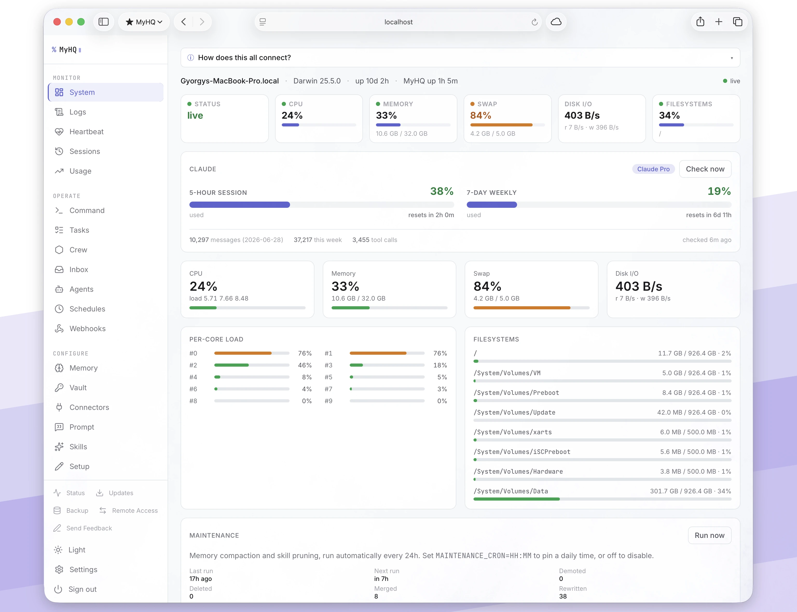

Open source. Built on real **Claude Code** agents running on your machine, so every agent can read files, run commands, edit code, check services, and ship things. Replies stream back live and risky actions are gated behind your approval.

> **These agents can read, write, and run commands on the machine they run on.** Access is gated by a Telegram user-id allow-list (and, for the panel, a secret token). Keep `ALLOWED_USER_IDS` tight and run it on a machine you control.

## The Command Structure

MyHQ runs like a small ops team. Every agent knows their role and who they report to.

```
You (President)
Atlas  (chief coordinator, runs everything day-to-day)
  Finance Lead     cost tracking, budgets, analytics
  DevOps Lead      infra, deployments, monitoring
  Research Lead    deep dives, reports, synthesis
  ... any Lead you create, each with their own Telegram bot
      Assistant
      Assistant
```

**You** set direction and make final calls. **Atlas** coordinates the team, handles whatever you send him, and knows his Leads' portfolios. **Leads** own their domain. They run specialized autonomous turns, have their own memory and session, and optionally appear as a separate Telegram bot you can message directly. **Assistants** are sub-agents scoped to a Lead.

## Two Ways In

The same agents, two front doors:

**Telegram**: message Atlas from your phone. The old loop for touching a server (open a terminal, SSH in, run something, close it) becomes a chat with something already living on the server that knows your system. When a service falls over at 2 am you get a ping and fix it from the couch, no SSH client required. Your Leads have their own bots, so you can message your DevOps Lead directly without going through Atlas.

**MyHQ Panel**: an optional web dashboard served in the same process. Chat with Atlas in the browser, see your full crew hierarchy, watch live system health, run and schedule agents, delegate task-board cards to autonomous runs, browse memory and skills, manage secrets, and tune proactive monitoring.

## Quick Install

### Linux / macOS

On a fresh machine, the wizard installs everything (Node 20+, git, the Claude CLI), clones the repo, builds it, walks you through `.env`, and optionally sets up a background service:

```bash
curl -fsSL https://gyorgy.sh/myhq-install.sh | bash
```

### Windows

**First, open PowerShell as Administrator:**

1. Press the **Windows** key.
2. Type `powershell`.
3. Right-click **Windows PowerShell** in the results and choose **Run as administrator**.
4. Click **Yes** on the User Account Control prompt.

The title bar should read **Administrator: Windows PowerShell**.

**Then paste these two lines and press Enter:**

```powershell
Set-ExecutionPolicy -Scope Process -ExecutionPolicy Bypass -Force
irm https://gyorgy.sh/myhq-install.ps1 | iex
```

The first line lets PowerShell run the `npm`/`claude` script shims for this session only (Windows blocks them by default); it isn't persisted and needs no admin. The Windows installer uses `winget` for Node.js and Git, and creates a NSSM service (with Task Scheduler as a fallback). To update later, run `.\scripts\windows\update.ps1` or use the panel's Updates view.

If you run it **without** administrator rights, the installer prints these same steps and waits for a keypress before closing, so the window won't vanish on you.

You will need a [bot token](#setup-manual) and your numeric Telegram user id. The wizard prompts for both. Prefer to read before you run? The scripts are [`scripts/myhq-install.sh`](scripts/myhq-install.sh) and [`scripts/windows/myhq-install.ps1`](scripts/windows/myhq-install.ps1).

> For an unattended run, set `MYHQ_TOKEN`, `MYHQ_USER_IDS`, and `MYHQ_MODE=service|manual` (and `MYHQ_YES=1`) in the environment before running.

## The Panel

| | |
| --- | --- |
| 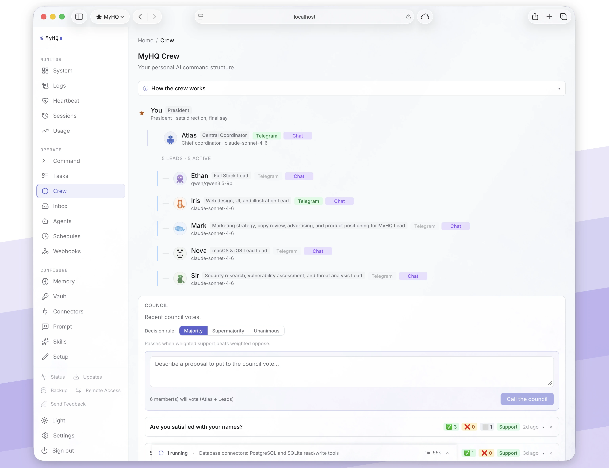 | 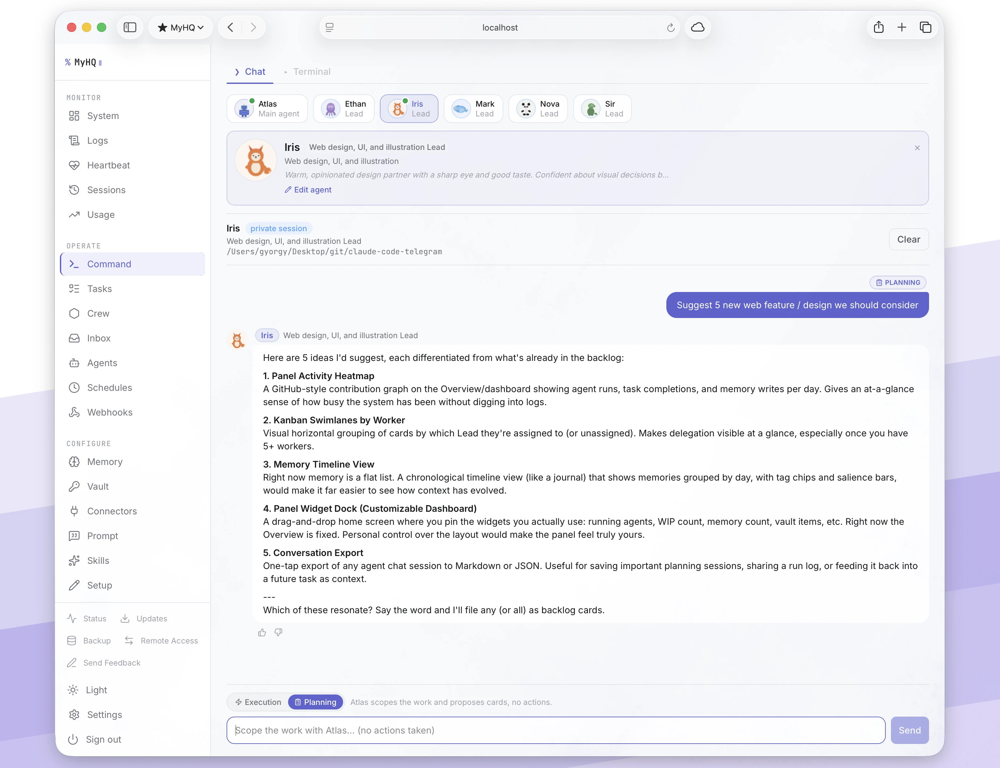 |
| **Crew**: see the full org chart (President, Atlas, Leads, Assistants), each with its model and Telegram/chat status. Council vote history and a configurable decision rule (majority/supermajority/unanimous) live here. | **Command**: chat with Atlas or any Lead right in the browser, with their own session and cwd. Toggle **Planning** (scope the work, propose cards, no actions) or **Execution** (act). |
| 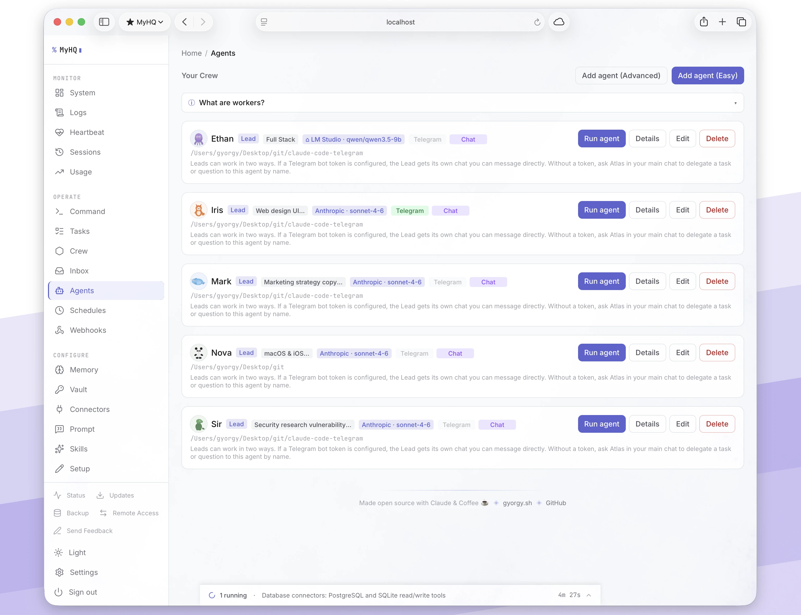 | 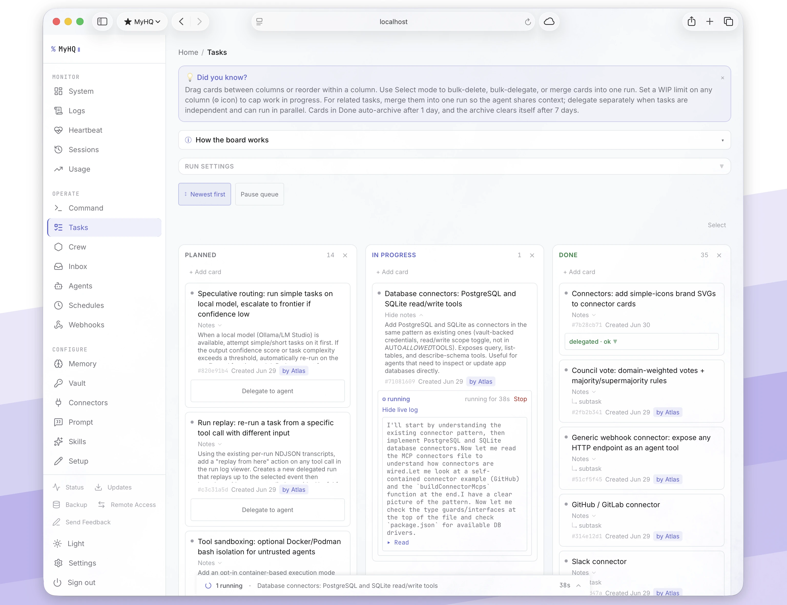 |
| **Agents**: manage your crew. Each Lead can run a one-shot turn, get its own Telegram bot, or be delegated work by Atlas by name. Add agents with an easy or advanced flow. | **Tasks**: a Kanban board with drag-and-drop, priority, WIP limits, custom columns, and a Delegate button that hands a card to an autonomous agent run. Watch the live log as it works. |
| 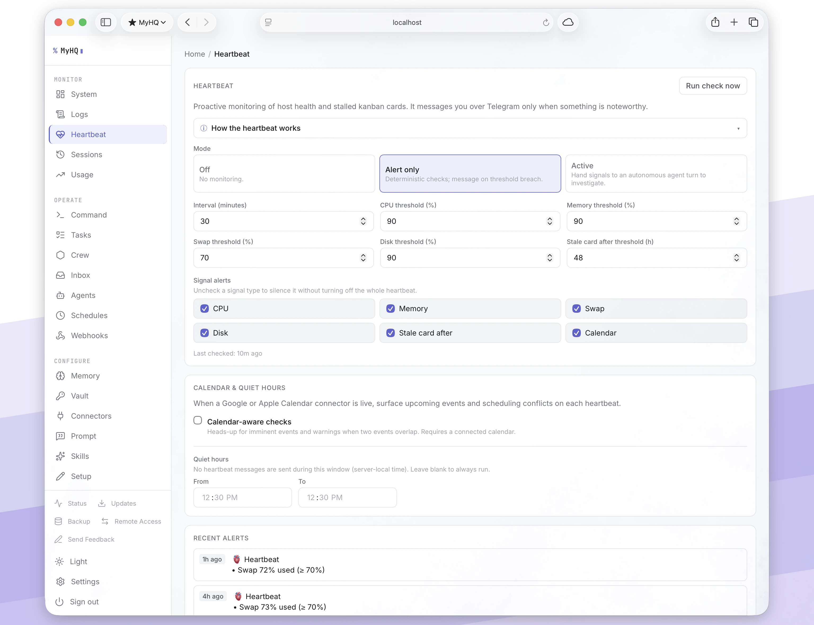 | 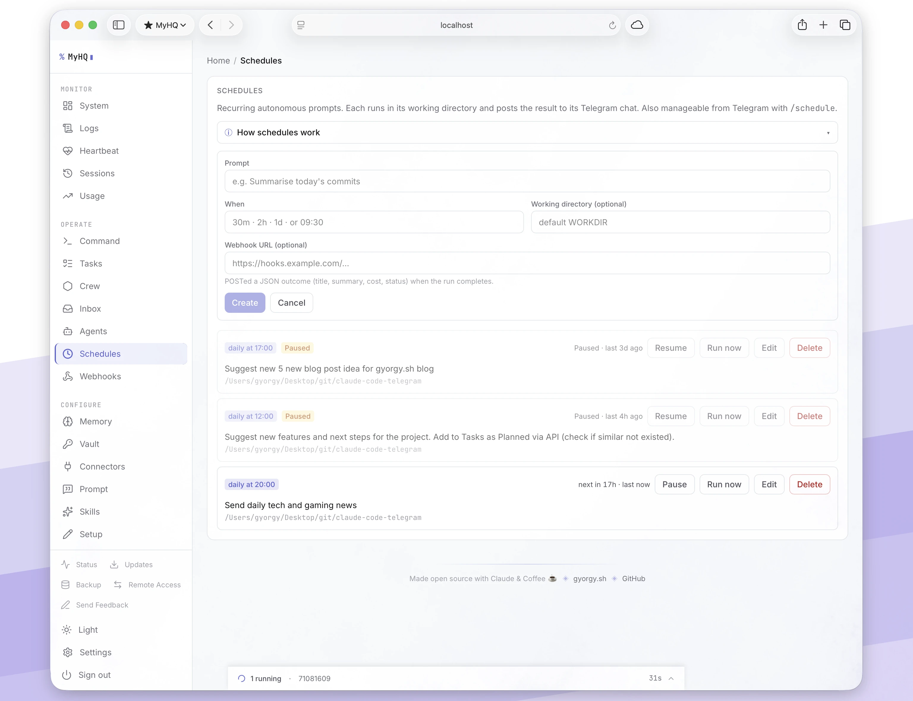 |
| **Heartbeat**: proactive monitoring. Set CPU/mem/swap/disk and stale-card thresholds, mute individual signals, set quiet hours; Atlas pings Telegram on breach, or runs an autonomous turn to investigate and act first. | **Schedules**: create timed autonomous prompts (`30m`, `2h`, `HH:MM`) from the panel or via `/schedule` in chat, each in its own cwd, with results pushed back to Telegram or a webhook. |
| 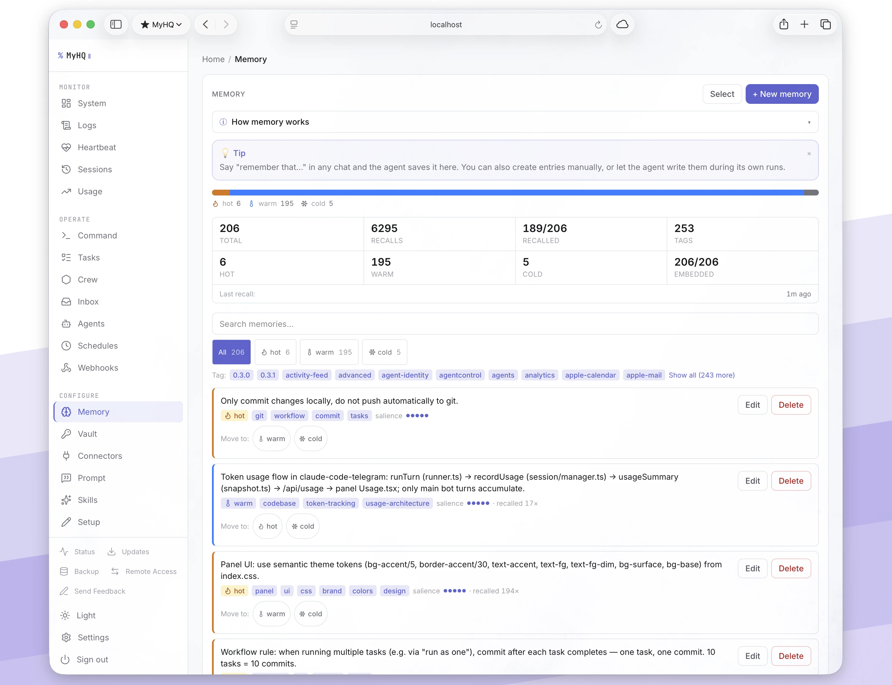 | 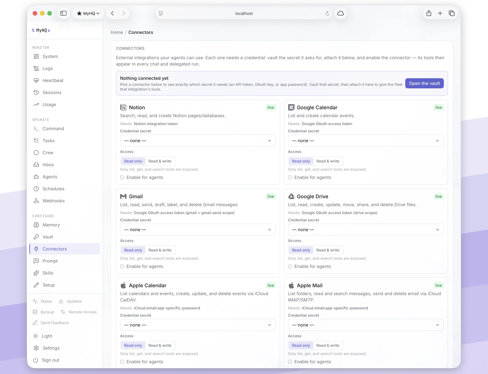 |
| **Memory**: a tier-based fact store (hot/warm/cold) that agents write to and recall from automatically, with optional semantic search. Search, edit, promote, demote, and delete entries from the panel. | **Connectors**: attach a vaulted credential and toggle read/write scope to give the fleet live Notion, Google Calendar/Gmail/Drive, Apple Calendar/Mail, Slack, GitHub, Unreal, Unity, PostgreSQL, and SQLite tools. |
| 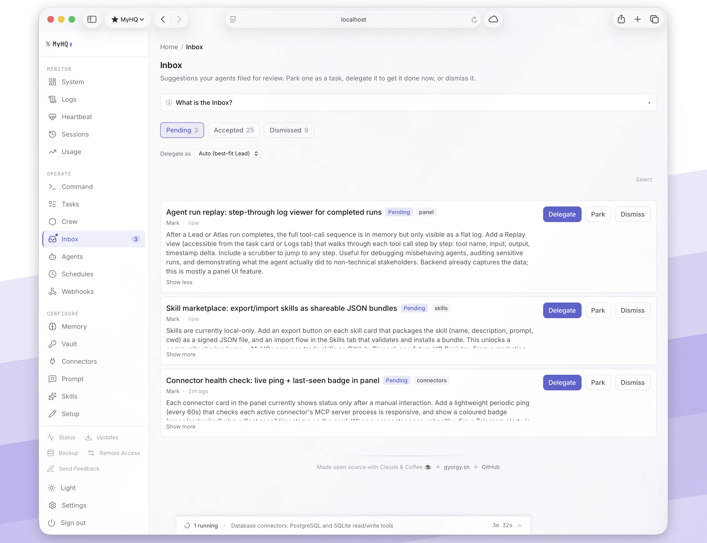 | 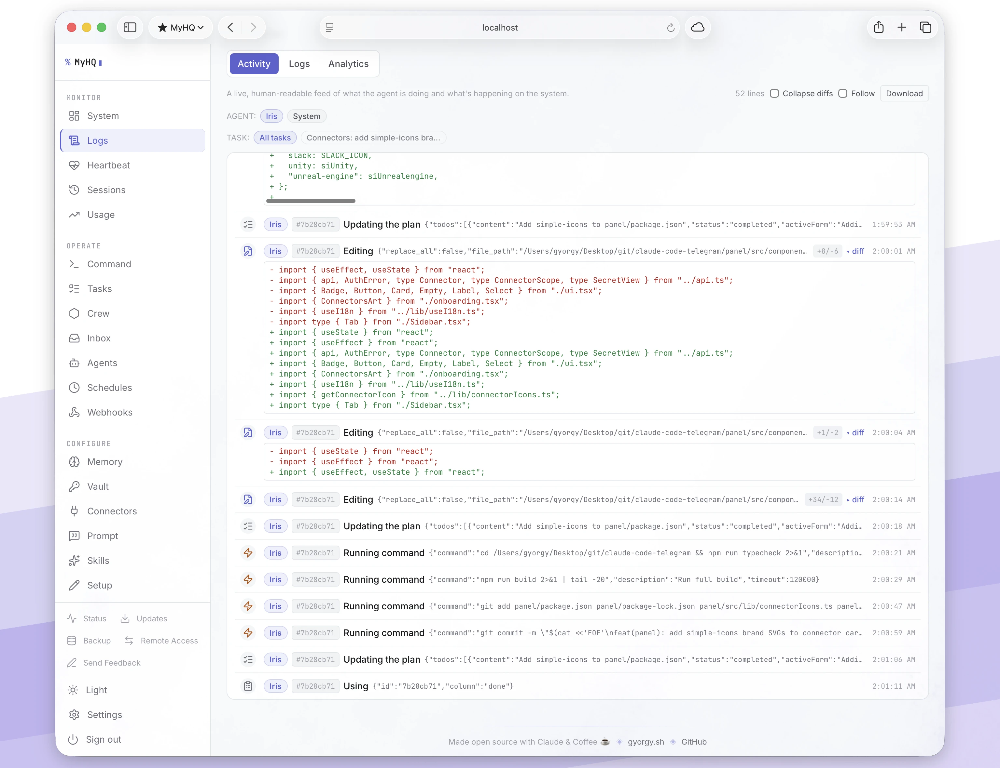 |
| **Inbox**: suggestions your agents file for review. Park one as a backlog task, delegate it to a best-fit Lead to get it done now, or dismiss it. | **Logs**: a live, human-readable feed of what each agent is doing — edits with diffs, commands, plan updates — plus raw searchable history and usage analytics. |
| 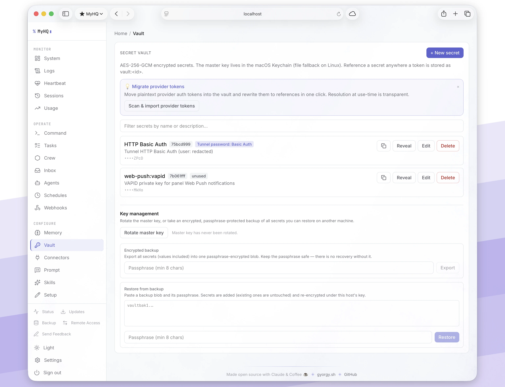 | 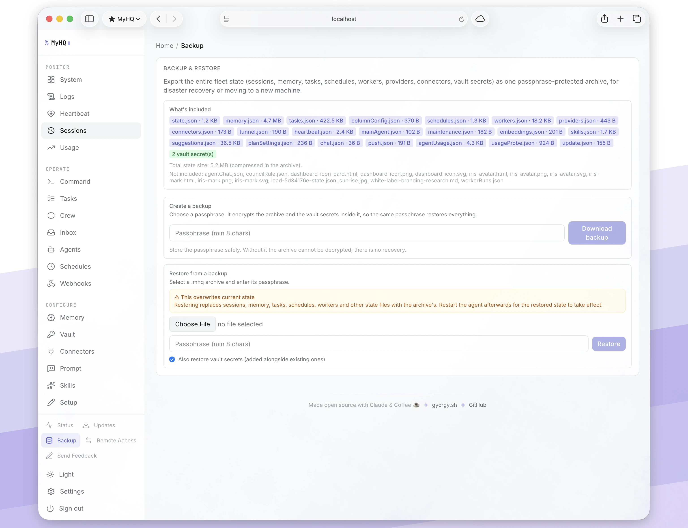 |
| **Vault**: AES-256-GCM encrypted secrets referenced anywhere as `vault:<id>`. Reveal, rotate the master key, scan & import plaintext provider tokens, and take a passphrase-encrypted backup. | **Backup**: export the entire fleet state (sessions, memory, tasks, schedules, workers, providers, connectors, vault secrets) into one passphrase-protected archive for disaster recovery or moving machines. |

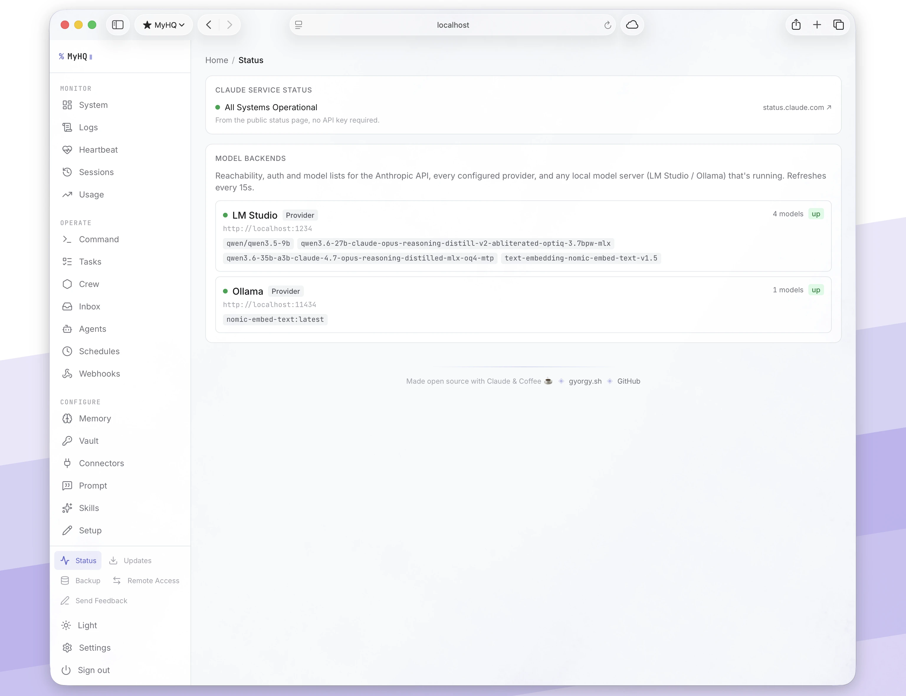

**Status**: the public Claude service status with no API key required, plus live reachability, auth, and model lists for the Anthropic API, every configured provider, and any local model server (LM Studio, Ollama) that's running. See [Bring Your Own Model](#bring-your-own-model).

Also inside: **System** (live CPU per-core, memory, swap, disk I/O), **Status** (Claude service status + provider/local-backend probes), **Memory** (tier-based fact store with hot/warm/cold recall plus optional semantic search), **Vault** (AES-256-GCM secrets), **Skills** (reusable workflows), **Prompt** (playbook editor), **Logs** (a human-readable activity feed, raw searchable history with 72h rotation, and usage analytics), **Terminal** (a live shell session in the browser, off by default), **Connectors** (live Notion, Google Calendar, Gmail, Google Drive, Apple Calendar, Apple Mail, Slack, GitHub, Unreal Engine, Unity, PostgreSQL, and SQLite integrations with per-connector read/write scope, plus custom webhook tools and inbound webhook triggers), **Updates** (check, apply, and roll back versions in place, with a "What's new" changelog of newer releases), **Remote Access** (expose the panel over a secure tunnel for phone access), **Approvals** (pending tool-call approvals queued from any chat, resolvable from the browser instead of Telegram), **Web Push** (browser push notifications — tap-to-open on tool approvals, task failures, and test pings — using a VAPID keypair that is auto-generated and stored in the vault), **Feedback** (send a bug report or suggestion straight from the dashboard), **Settings** (main agent, plan and budget tracker, language, model providers with live local-backend status), and more. A sticky connection banner warns when the backend goes away and the dashboard reloads itself once it recovers. On first visit, a **guided setup wizard** helps you pick a quick-start scenario or walk through full crew creation step by step.

## In Telegram

| | |
| --- | --- |
|  |  |
| Just talk to Atlas: he creates task-board cards, runs scheduled briefings, ships commits, and reports back, all from the chat. | Replies stream back live as they're written using Telegram's Rich Messages API, then land as a clean formatted message. |
|  |  |
| Every non-read-only tool call pauses and shows exactly what's about to run. Tap **Approve**, **Deny**, or **Always allow** to whitelist the tool for the session. | Switch modes with `/mode`. Approve and the action runs; deny and Atlas backs off and tells you what it skipped. |

## What Makes It a Fleet, Not Just a Bot

**Memory that accumulates.** Agents save durable facts with `memory_write` and recall relevant ones automatically each turn. Three tiers: *hot* entries inject into every turn unconditionally; *warm* entries are keyword-recalled when relevant; *cold* entries are panel-only and excluded from agent context. Tiers decay automatically (hot to warm after 7 days without recall, warm to cold after 30 days) and can be promoted or demoted from the panel.

**Skills that compound.** When Atlas works out a procedure worth reusing, he distils it into the skills library with `skill_save`. Next time a similar request comes in, he pulls the skill and runs it. The library grows with use. Expensive turns (over $0.05 or 30s) trigger an automatic haiku extraction pass that proposes new skills for review.

**Leads with portfolios.** Each Lead has a domain (Finance, DevOps, Research, whatever you define). Their system prompt is shaped around that portfolio so they think and act like a specialist, not a generalist. Create a Lead for anything recurring in your life or work.

**Lead bots.** Give a Lead a Telegram bot token and they get their own chat. Message your Finance Lead directly with spend questions. Message your DevOps Lead directly for infra work. Same allowed-user list as Atlas, separate sessions and context. Lead bots accept photos and documents just like the main bot: photos are passed as inline vision content; documents are downloaded to the Lead's working directory. Results stream back the same way, with the work log collapsing to a single closing sentence.

**Atlas knows his team.** Every turn, Atlas's system prompt is automatically updated with the current Lead roster (who they are, what they own). He can reference them, delegate to them, and tell you which Lead to ask.

**Council votes.** Use `/council <proposal>` to put an idea to a full council vote from Telegram or directly from the panel Crew tab. Atlas always votes alongside the Leads. Every enabled Lead evaluates the proposal from their domain's perspective and returns a SUPPORT or OPPOSE vote with a one-sentence reason and a one-sentence concern. Results arrive in Telegram with individual breakdowns and a final tally. A vote requires at least one enabled Lead; if none exist, the panel shows an amber "No quorum" banner. All sessions are stored and visible in the panel Crew tab; individual sessions can be deleted.

**Inter-agent delegation.** Atlas can delegate subtasks directly to Leads via `crew_delegate`, receive their output inline, and report back to you. Leads can ask you a question mid-turn with `crew_ask_president` (which pauses until you reply), file a report with `crew_report`, or queue non-urgent ideas with `crew_suggest`. Suggestions land in a persistent inbox — triage them from the `/inbox` Telegram command or the panel: **Park** turns it into a backlog card, **Delegate** files the card and routes it to a Lead immediately, **Dismiss** archives it. A persistent delegation log tracks all cross-agent activity.

**Personas.** Give Atlas or any Lead a persona: concise and direct, warm and encouraging, formal and precise, or fully custom. Persona shapes character and tone; system prompt carries domain knowledge. Both are set separately and combine naturally.

**Autonomy levels.** Three tiers replace the old on/off toggle: *supervised* (every tool call prompts for approval), *standard* (safe read-only tools run freely, risky ones prompt (the default)), and *full* (no prompts, fully autonomous). Set globally per agent, or change per-chat with `/mode`.

**Language.** Choose the language Atlas or any Lead responds in. The panel Settings tab has a global default; individual agents can override it; and per-chat `/lang <code>` overrides them all. Thirty languages available (English, Hungarian, Spanish, French, German, and more). The panel interface itself is available in English and Hungarian. All Telegram bot messages, command responses, and inline button labels are fully translated — every string the bot sends resolves through the same language stack.

**Autonomous delegation.** Task cards on the board can be delegated to an agent run with one button. The agent can break cards into subtasks, complete them, and move the card to Done without you touching it.

**Proactive monitoring.** The heartbeat runs in the background watching host health and stalled task cards. It can alert you, or it can run an autonomous turn to investigate and act first. Individual signal types (cpu, mem, swap, disk, stale cards) can be muted independently from the panel without disabling the whole heartbeat. **Quiet hours** (`quietStart`/`quietEnd` in HH:MM) suppress all signals during a time window — useful for silencing overnight alerts. **Calendar-aware mode**: when a Google or Apple Calendar connector is enabled, the heartbeat scans upcoming events within a configurable lookahead window and briefs Atlas before each one so he can prepare context, materials, or reminders in advance.

**Scheduled runs.** Set any agent or Lead to run a prompt on a timer: check disk space at 9am, summarize logs every 2 hours, pull a report every Monday. A daily maintenance window can compact memory (a small Haiku model reads the hot and warm tiers, consolidates near-duplicate entries into one clear entry, drops redundant copies, and shortens any entry over 220 characters into a single terse sentence) and auto-archive unused skills older than 14 days. A dry-run preview in the panel Health card shows which entries would be deleted, demoted, or merged before the next run fires.

**Claude usage tracking.** The System and Usage panels show live session and weekly limits pulled from the official Anthropic OAuth API (`GET /api/oauth/usage`, `GET /api/oauth/profile`) using the token the Claude Code CLI stores in your Keychain. No separate API key or credentials needed. Shows 5-hour session utilisation and 7-day weekly utilisation, each with an exact reset countdown, severity color, and auto-refresh on a configurable schedule (default 30 minutes). Historical activity (message counts, token breakdown by model, 14-day sparkline) comes from `~/.claude/stats-cache.json`. Subscription type (Claude Pro / Max) is auto-detected and shown in Settings.

**Budget tracking.** For API users, set a monthly cap and billing day. The Usage panel overlays a cap line on the daily cost chart and shows period spend, daily average, and estimated monthly total. Configure Telegram alerts at any threshold and optional automatic spend reports on a schedule.

## Bring Your Own Model

MyHQ isn't locked to Anthropic. Point any agent at any model: a hosted Claude tier, a local model served by **LM Studio** or **Ollama**, or any OpenAI-compatible proxy. Pick the model per role:

- **Per-Lead model routing.** Every Lead, Assistant, and worker runs on its own model and provider. Route routine background work to a cheap local model and reserve a frontier model only for the agents that need it — each agent in the fleet can be on a different backend at once.
- **Offline semantic memory.** Memory recall ranks by embedding similarity computed locally. Auto mode probes Ollama (`:11434`) then LM Studio (`:1234`) at startup and uses whichever is live, so semantic search works fully offline with no API key. Pin a backend or turn it off from Settings.
- **Offline voice.** Voice-message transcription runs fully offline with **Vosk**, or against any OpenAI-compatible endpoint (OpenAI, Groq's free tier) if you prefer.
- **Main agent.** Set the model and provider that drives Atlas from Settings (or with `/model` in chat). Switch between Opus, Sonnet, Haiku, or a local model live; the change takes effect on the next message.

Add a provider once (base URL + token, with LM Studio / Ollama prefill presets), and MyHQ lists its available models server-side so you can pick by name. Provider tokens are stored in the encrypted vault.

## Setup (manual)

> **New here? Start with the setup wizard instead.** The one-line installer in [Quick Install](#quick-install) (↑ top of this README) handles Node, git, the Claude CLI, the clone, the build, your `.env`, and an optional background service for you. The manual steps below are for when you already have a checkout or want full control.

> No background services installed: full functionality is available. Install as a service later without touching your checkout or data.

1. **Create a bot**: message [@BotFather](https://t.me/BotFather), run `/newbot`, copy the token.
2. **Find your user id**: message [@userinfobot](https://t.me/userinfobot).
3. **Configure**:
   ```bash
   cp .env.example .env
   # edit .env: TELEGRAM_BOT_TOKEN, ALLOWED_USER_IDS, WORKDIR
   ```
4. **Install and run**:
   ```bash
   npm install
   npm run dev         # watch mode (reloads on change)
   # or: npm run build && npm start
   ```

## Run as a Service

```bash
./scripts/install-service.sh        # builds, installs and starts the service
./scripts/agentctl.sh status        # start | stop | restart | status | logs
./scripts/agentctl.sh logs          # follow logs
```

**Linux**: systemd unit (`myhq`). The installer adds a scoped, passwordless sudoers rule.

**macOS**: per-user LaunchAgent (`sh.gyorgy.myhq`) that runs in your login session; no sudo needed.

**Windows**: NSSM service (`myhq`) or Task Scheduler entry. Managed via `nssm start|stop|restart myhq` or the Task Scheduler GUI.

You can also ask Atlas to restart himself: "restart yourself" triggers `./scripts/agentctl.sh restart`.

### Update and uninstall

```bash
./scripts/update.sh                 # git pull + npm install + build, restarts if service is installed
./scripts/uninstall-service.sh      # remove the service (leaves checkout, .env and data/ intact)
```

On Windows (elevated PowerShell):

```powershell
.\scripts\windows\update.ps1        # same as above, restarts the NSSM service / scheduled task
.\scripts\windows\uninstall.ps1     # remove the service/task (optionally deletes the install dir)
```

## Configuration

| Variable | Required | Description |
| --- | --- | --- |
| `TELEGRAM_BOT_TOKEN` | yes | Token from @BotFather (Atlas's bot) |
| `ALLOWED_USER_IDS` | yes | Comma-separated numeric Telegram user ids |
| `WORKDIR` | no | Directory Atlas starts in (default: `data/`) |
| `STATE_FILE` | no | Session + usage persistence path (default `data/state.json`) |
| `CLAUDE_MODEL` | no | Default model id (default `claude-opus-4-8`) |
| `ANTHROPIC_API_KEY` | no | API key; omit to use `claude` CLI login |
| `APPROVAL_TIMEOUT_MS` | no | Approval wait before auto-deny (default `300000`) |
| `LOOP_THRESHOLD` | no | Repeats of an identical tool call before the loop guard fires (default `3`; `0` disables) |
| `TURN_RATE_LIMIT` | no | Max turns a single chat may start in one window (default `5`; `0` disables) |
| `TURN_RATE_WINDOW_MS` | no | Rolling window for the per-chat turn rate limit in ms (default `60000`) |
| `STREAM_MODE` | no | `rich` (default), `draft`, or `edit` |
| `ATLAS_NAME` | no | Override the main agent's name (default `Atlas`) |
| `BRAND_NAME` | no | Override the product name (default `MyHQ`) |
| `DEFAULT_LANGUAGE` | no | BCP 47 language code for agent responses (default `en`) |
| `AUTO_SKILL_GENERATION` | no | `true` to auto-extract skills from expensive turns (default `false`) |
| `MAINTENANCE_CRON` | no | memory compaction + skill pruning. Unset (default) runs every 24h; `HH:MM` (server time) pins a daily run; `off` disables |
| `MEMORY_MAX_ENTRIES` | no | Warm entry cap before compaction triggers (default `500`) |
| `COLD_MAX` | no | Cold entry cap before deletion (default `200`) |
| `MEMORY_SHORTEN_CHARS` | no | Maintenance rewrites any memory longer than this into a terse one-liner (default `220`; `0` disables) |
| `EMBEDDING_ENABLED` | no | `auto` (default): probe and auto-detect a live local backend (Ollama or LM Studio). `on`: pin the `EMBEDDING_*` backend below. `off`: force embeddings off. `on`/`off` lock the panel control |
| `EMBEDDING_PROVIDER` | no | Pinned backend shape: `ollama` (POST `/api/embeddings`) or `openai` (POST `/v1/embeddings`, for LM Studio and OpenAI) |
| `EMBEDDING_BASE_URL` | no | Pinned embedding endpoint base URL (default `http://localhost:11434`) |
| `EMBEDDING_MODEL` | no | Pinned embedding model id (default `nomic-embed-text`) |
| `EMBEDDING_AUTH_TOKEN` | no | Optional auth token for the embedding endpoint (plain or `vault:<id>`) |
| `LOG_LEVEL` | no | `error`, `warn`, `info` (default), `debug` |
| `TRANSCRIBE_PROVIDER` | no | Voice transcription backend: `openai` (default) or `vosk` (local) |
| `OPENAI_API_KEY` | no | API key for the `openai` transcription backend (OpenAI, Groq, ...) |
| `TRANSCRIBE_MODEL` | no | Transcription model (default `whisper-1`) |
| `TRANSCRIBE_BASE_URL` | no | OpenAI-compatible base URL for transcription (default `https://api.openai.com/v1`) |
| `VOSK_MODEL_PATH` | no | Path to an unpacked Vosk model dir |
| `FFMPEG_PATH` | no | ffmpeg binary for voice note decoding (default `ffmpeg`) |
| `TTS_PROVIDER` | no | Voice reply (TTS) backend: `openai` (default) or `piper` (fully local) |
| `TTS_MODEL` | no | TTS model id (default `tts-1`; ignored for piper) |
| `TTS_VOICE` | no | TTS voice name (default `alloy`; ignored for piper) |
| `TTS_BASE_URL` | no | OpenAI-compatible TTS base URL (default `https://api.openai.com/v1`) |
| `PIPER_PATH` | no | Path to the piper binary for local TTS (default `piper`) |
| `PIPER_MODEL` | no | Path to a `.onnx` Piper voice model |
| `WORK_FILE` | no | Path to Atlas's operator playbook (default `work.md`) |
| `PANEL_ENABLED` | no | `true` to start the MyHQ Panel (default `false`) |
| `PANEL_TOKEN` | when panel on | Shared secret for all panel requests |
| `PANEL_HOST` | no | Bind address (default `127.0.0.1`) |
| `PANEL_PORT` | no | Port (default `8787`) |
| `PANEL_CHAT_ENABLED` | no | `false` to hide the panel Chat view (default `true`) |
| `PANEL_TERMINAL_ENABLED` | no | `true` to enable the in-browser shell (default `false`; a panel-token holder gets host execution) |
| `PANEL_TERMINAL_INHERIT_ENV` | no | `true` to give the terminal the full process env instead of a sanitized allow-list (default `false`, risky) |
| `PANEL_TUNNEL_ENABLED` | no | `true` to allow Remote Access (expose the panel over an ngrok/cloudflared tunnel; default `false`) |
| `FEEDBACK_URL` | no | Where the panel Feedback form relays reports (default `https://gyorgy.sh/myhq_feedback`) |

### Streaming modes

| Mode | How it works | Notes |
| --- | --- | --- |
| `rich` | Bot API 10.1 Rich Messages | Default. Structured formatting. Private chats only. |
| `draft` | Bot API 9.3 `sendMessageDraft` then `sendMessage` | Animated preview, finalized as a formatted message. Private chats only. |
| `edit` | Throttled `editMessageText` of a placeholder | Most compatible fallback. Works in any chat type. |

### Voice

**Transcription**: send a voice note and it is transcribed and run like a typed prompt. Two backends via `TRANSCRIBE_PROVIDER`:

**`openai`** (default): any OpenAI-compatible `/audio/transcriptions` endpoint. Use OpenAI directly, or **Groq's free tier**: set `TRANSCRIBE_BASE_URL=https://api.groq.com/openai/v1`, `TRANSCRIBE_MODEL=whisper-large-v3-turbo`, and a Groq `OPENAI_API_KEY`.

**`vosk`**: fully local and offline.
```bash
npm install vosk
# install ffmpeg, download and unpack a model from https://alphacephei.com/vosk/models
```
Then set `VOSK_MODEL_PATH=/path/to/vosk-model` and `TRANSCRIBE_PROVIDER=vosk`.

**Spoken replies (TTS)**: toggle with `/voice on` / `/voice off`. When on, Atlas speaks its final reply as a Telegram voice message in addition to the text. Two backends via `TTS_PROVIDER`:

**`openai`** (default): any OpenAI-compatible `/audio/speech` endpoint (`TTS_MODEL`, `TTS_VOICE`, `TTS_BASE_URL`).

**`piper`**: fully local, offline TTS. Install the binary and download an `.onnx` voice model, then set `PIPER_PATH` and `PIPER_MODEL`.

## Enabling the Panel

The panel is served **in the same process** as the bot (no extra service). Off by default because it has the same reach as the bot.

```bash
PANEL_ENABLED=true
PANEL_TOKEN=choose-a-long-random-secret   # required; startup fails without it
```

```bash
npm run build && npm start
# dev: npm run dev   (bot + panel reload together)
```

Open `http://127.0.0.1:8787` and unlock with your `PANEL_TOKEN`. Keep the bind on loopback and reach it only behind a reverse proxy or private network (e.g. Tailscale). Light / dark / hacker themes, URL per view.

## Panel API

Everything the panel does is a REST call you can script. Auth is the same `PANEL_TOKEN`, sent as a Bearer header (`Authorization: Bearer $PANEL_TOKEN`) for REST and `?token=` for the WebSocket. All write endpoints take and return JSON. The full catalogue with copy-paste `curl` examples lives in [`PANEL_API.md`](PANEL_API.md); the groups are:

| Group | Endpoints |
| --- | --- |
| Main agent | `GET\|PUT /api/agent`, `PUT /api/agent/embeddings`, `PUT /api/agent/embeddings/preferred`, `POST /api/agent/embeddings/auto`, `POST /api/agent/reset`, `POST /api/agent/restart` |
| Workers (Leads/Assistants) | `GET\|POST /api/workers`, `GET\|PUT\|DELETE /api/workers/:id`, `POST /api/workers/:id/run\|stop`, `GET /api/workers/:id/runs`, `POST /api/workers/wizard` |
| Crew | `GET\|POST /api/council`, `DELETE /api/council/:id`, `GET\|PUT /api/council/rule`, `GET /api/delegations`, `GET /api/runs`, `GET /api/runs/:runId/log` |
| Suggestions | `GET /api/suggestions`, `POST /api/suggestions/:id/accept\|delegate\|dismiss` |
| Tasks | `GET\|POST /api/tasks`, `PATCH\|DELETE /api/tasks/:id`, `POST /api/tasks/:id/delegate\|stop\|retry\|unstick`, `POST /api/tasks/reorder`, `GET\|POST /api/tasks/columns`, `PUT\|DELETE /api/tasks/columns/:id`, `POST /api/tasks/columns/reorder`, `PUT /api/tasks/wip`, `GET\|PUT /api/tasks/config` |
| Schedules | `GET\|POST /api/schedules`, `PUT\|DELETE /api/schedules/:id`, `PUT /api/schedules/:id/enabled`, `POST /api/schedules/:id/run` |
| Memory | `GET\|POST /api/memories`, `PUT\|DELETE /api/memories/:id`, `PATCH /api/memories/:id/tier`, `GET /api/memories/stats` |
| Skills | `GET\|POST /api/skills`, `PUT\|DELETE /api/skills/:id` |
| Providers and backends | `GET\|POST /api/providers`, `PUT\|DELETE /api/providers/:id`, `GET /api/providers/:id/models`, `POST /api/providers/models`, `GET /api/integrations/ollama\|lmstudio`, `POST /api/integrations/ollama\|lmstudio/connect` |
| Vault | `GET\|POST /api/vault`, `PUT\|DELETE /api/vault/:id`, `GET /api/vault/:id/reveal`, `POST /api/vault/import`, `POST /api/vault/rotate`, `POST /api/vault/export`, `POST /api/vault/import-backup` |
| Plan and usage | `GET\|PUT /api/plan`, `POST /api/plan/report-test`, `GET /api/usage`, `GET /api/usage/agents`, `GET /api/usage-probe`, `POST /api/usage-probe/run`, `GET /api/claude-usage` |
| Approvals | `GET /api/approvals`, `POST /api/approvals/:id/resolve` |
| Web Push | `GET /api/push`, `POST /api/push/subscribe`, `DELETE /api/push/subscribe/:id`, `POST /api/push/test` |
| Monitoring | `GET /api/health`, `GET /api/status`, `GET /api/sessions`, `GET /api/audit`, `GET\|PUT /api/heartbeat`, `POST /api/heartbeat/run`, `GET /api/maintenance`, `POST /api/maintenance/run`, `POST /api/maintenance/preview` |
| Content and config | `GET\|PUT /api/prompt`, `POST /api/prompt/restore`, `GET /api/claude-files`, `GET\|PUT /api/claude-files/content`, `GET /api/languages`, `GET /api/connectors`, `PUT /api/connectors/:id`, `GET\|PUT /api/branding`, `GET /api/conversations/search` |
| Webhooks | `GET\|POST /api/webhook-tools`, `PUT\|DELETE /api/webhook-tools/:id`, `GET\|POST /api/webhook-triggers`, `PUT\|DELETE /api/webhook-triggers/:id`, `POST /api/webhook-triggers/:id/rotate`, `GET /api/webhook-triggers/:id/secret`, `POST /hook/:id` (public, HMAC) |
| Logs | `GET /api/logs`, `GET /api/logs/dates`, `GET /api/logs/search`, `GET /api/logs/summary` |
| Updates | `GET /api/update`, `POST /api/update/check\|run\|restore` |
| Panel chat and terminal | `GET /api/chat`, `POST /api/chat/send\|stop\|clear\|approve`, `PUT /api/chat/settings`, `GET /api/agent-chat/:id`, `POST /api/agent-chat/:id/send\|stop\|clear`, `PUT /api/agent-chat/:id/settings`, `GET /api/terminal`, `POST /api/terminal/spawn\|resize` |
| Remote access (tunnel) | `GET\|PUT /api/tunnel`, `POST /api/tunnel/start\|stop`, `GET\|POST /api/tunnel/password` (all `PUT`/`start`/`stop`/`password` are 403 unless `PANEL_TUNNEL_ENABLED`) |
| Misc | `GET /api/me` (deployment facts), `POST /api/feedback` (relay a bug report / suggestion) |
| Realtime | `GET /ws` (worker, chat, agent-chat, task, health, tunnel, suggestion, and log frames) |

## Permissions

Nothing runs without your say-so. For every non-read-only tool call you get an inline prompt showing exactly what is about to happen:

**Approve**: run it once.
**Deny**: refuse it.
**Always allow**: stop asking for that tool for the rest of this session.

Three autonomy levels via `/mode`:

- **supervised**: all tools prompt, nothing runs automatically. Strictest.
- **standard**: read-only tools (`Read` / `Glob` / `Grep`) run automatically; risky tools (Bash, Write, Edit) prompt. This is the default.
- **full**: bypass all permissions. Use for trusted autonomous runs.

Lead bots default to standard mode with the same approve/deny prompts.

## Full Feature List

- **Crew hierarchy**: President, Atlas, Leads, Assistants. Each level knows the one above it. Leads have portfolios, their own sessions, and optionally their own Telegram bots. Each Lead bot keeps its own conversation in `data/lead-<id>-state.json` (the same resume-token store as the main session), so a Lead chat survives a restart or update — the gitignored `data/` dir is left untouched by `update.sh`.
- **Council votes**: `/council <idea>` calls every enabled Lead plus Atlas himself, gets a SUPPORT/OPPOSE vote with domain reasoning from each, and delivers a tally to Telegram. Votes are **relevance-weighted** — each voter counts in proportion to how relevant the proposal is to their domain (everyone counts equally when embeddings are off) — and the decision rule is configurable: simple majority (default), supermajority (≥2/3), or unanimous. Requires at least one enabled Lead; otherwise returns `noQuorum` and shows an amber banner in the panel. Full history in the panel Crew tab; individual sessions can be deleted (`DELETE /api/council/:id`).
- **Inter-agent crew tools**: `crew_delegate` (hand a task to a Lead and get their output back), `crew_report` (log a summary and optionally notify the president), `crew_ask_president` (pause until the user replies, then continue), `crew_suggest` (file a non-urgent idea to the president's persistent suggestion inbox). `crew_delegate` no longer lets a caller escalate privilege through the delegation chain: the child run's autonomy is capped at the caller's (only `full`/`auto_until_error` callers grant bypass), and a planning turn files the delegation to the inbox for explicit approval instead of firing real work. From Telegram `/inbox` or the panel Crew tab, triage each suggestion: **Park** (create a backlog card), **Delegate** (create and immediately route to a Lead), or **Dismiss** (archive).
- **Suggestion inbox** (`/inbox`): a persistent queue of non-urgent proposals from agents. Accepts `Park`, `Delegate`, and `Dismiss` actions with inline buttons in Telegram; panel Crew tab shows the same digest. Routes: `GET /api/suggestions`, `POST /api/suggestions/:id/accept|delegate|dismiss`.
- **Memory tiers**: hot (every turn), warm (keyword-recalled), cold (panel-only). Auto-decay and promote/demote controls in the panel.
- **Semantic memory**: recall ranks by meaning using a local embedding model, blending cosine similarity with keyword overlap and salience. On by default in auto mode: at startup the bot probes Ollama then LM Studio and enables embeddings against whichever is live, with zero configuration, re-selecting the live backend on every restart. It falls back to keyword search whenever no backend is reachable, so it is always safe to leave on. The Settings tab has an **Auto / Manual / Off** control (Auto is the default), shows live up/down status and available models for each local backend, one-click connect, and a preferred-backend pick when both are running. Non-panel users can force the mode with `EMBEDDING_ENABLED=auto|on|off` in `.env`, which locks the panel control when set to `on` or `off`. The same ranking powers `task_search` and `skill_search`, two auto-allowed tools that let agents find existing Kanban cards (by title and notes) and skills (by name, description, and prompt) by meaning before creating duplicates, with a keyword-only fallback when embeddings are off.
- **Auto skill extraction**: after expensive turns, an async haiku pass checks whether the work established a reusable procedure and proposes a skill entry. Gated by `AUTO_SKILL_GENERATION=true`.
- **Maintenance scheduler**: daily window for memory compaction (demote stale entries, a small Haiku model consolidates near-duplicate hot and warm entries into one clear entry and drops redundant copies, and any entry over `MEMORY_SHORTEN_CHARS` characters is condensed into a single terse sentence) and skill pruning (auto-archive unused skills older than 14 days). Triggered by `MAINTENANCE_CRON=HH:MM` or the panel's "Run now". The AI consolidation runs through the same Claude connection as the bot (CLI login or API key), so no separate key is needed; the deterministic demote/delete steps run regardless. A **dry-run preview** in the panel Health card shows which entries would be deleted, demoted, or merged before the next run fires (`POST /api/maintenance/preview`). Last-run time is cached across restarts and the System panel shows both the last and next run.
- **Personas**: preset options (Concise, Warm, Formal, Analytical, Playful) or fully custom. Persona shapes character and tone; domain knowledge stays separate in the system prompt.
- **Autonomy levels**: supervised / standard / full, replacing the old safe/auto toggle. Per-agent, per-session, and settable from the panel.
- **Language**: 30 languages for agent responses; global default from Settings; per-agent override on each Lead; per-chat `/lang` command. Panel interface available in English and Hungarian.
- **Branding overrides**: `ATLAS_NAME` and `BRAND_NAME` rename the agent and product for self-hosted deployments. **White-label** goes further — a panel surface to override the panel title, logo, favicon, colours, and email footer. It's a gated licensed feature: the configuration always exists and saves, but the overrides only take effect when you set `BRANDING_UNLOCKED=true` (free for self-hosters; there's no in-panel switch).
- **Daily digest**: `/digest` posts a tight summary of the last 24 hours of fleet activity to Telegram — tasks completed, autonomous runs that succeeded or errored, memories written, skills saved, and the day's cost.
- **Conversation search**: one panel search box over everything you've said and every autonomous run transcript on disk, ranked by meaning (the same hybrid cosine + keyword search as memory) with a snippet around the match.
- **Custom webhook tools**: register any HTTP endpoint in the panel and it becomes a callable agent tool (`webhook_<name>`); the agent fills in the declared query/header/body/path params and the call goes out through the SSRF-guarded fetch. Auth headers can reference a vaulted secret so tokens stay encrypted.
- **Inbound webhook triggers**: give an external service (a GitHub push, a Stripe event, an uptime ping) a public URL that fires an autonomous run. Each trigger has its own secret and authenticates callers with an HMAC-SHA256 signature over the request body — no panel token needed. A fired trigger files a task card, delegates it, and feeds the incoming payload into the prompt, reusing the full delegation path (transcript, retry, completion webhook).
- **Live streaming**: Telegram Rich Messages (Bot API 10.1) and message drafts (Bot API 9.3): replies animate as previews and land as clean, structured messages.
- **Proactive monitoring**: optional heartbeat watches host health (CPU/mem/swap/disk) and stalled task cards, pinging Telegram on breach, or running an autonomous turn to investigate first. Individual signal types (cpu, mem, swap, disk, stale) can be muted from the panel without disabling the whole heartbeat.
- **Secret vault**: AES-256-GCM encrypted secrets with the master key in the macOS Keychain (file fallback on Linux). Reference secrets anywhere as `vault:<id>`. The panel Vault view shows **usage badges** on each secret so you can see at a glance whether a secret is in use before deleting it. **Key rotation** (`POST /api/vault/rotate`) re-encrypts all secrets under a fresh key in one atomic operation. **Encrypted backup** (`POST /api/vault/export`) produces a portable passphrase-protected blob you can import on another machine; `POST /api/vault/import-backup` additively restores without touching existing entries.
- **Multi-agent task delegation**: task board cards can be delegated to an autonomous run. The agent can break cards into subtasks, complete them, and move the card to Done. When a delegated run breaks a card into subtasks, the parent card is auto-archived to keep the backlog clean. A global concurrency queue (`maxConcurrent`, default 3) prevents simultaneous delegation pile-ups; excess runs show a "queued" status in amber until a slot opens. Failed cards can be retried with one click from the panel or from the inline 🔁 button in Telegram — retry resumes the previous Claude session so context is not lost. Per-run transcripts are stored in `data/runs/` and viewable in the panel via `GET /api/runs/:runId/log`. **Blocked-by dependencies**: set `blockedBy` on a card to list prerequisite card ids; a delegated run won't start until all prerequisites have reached the Done column, preventing agents from working on things out of order.
- **Tasks board ergonomics**: an "+ Add card" button at the top of each column so you can prepend without scrolling. Bulk select mode lets you select multiple cards and Delete, Delegate, or "Run as one task" (combines their titles and notes into a single delegated run) in one shot; the bulk Delegate action includes a Lead picker so the selected cards run under a chosen Lead (or auto-routed). Cards with long or multi-line markdown notes get an inline expand/collapse toggle so you can read the full note without opening the edit form. Columns auto-archive cards once they exceed 20 items.
- **Recurring card templates**: mark a card as a daily, weekly, or monthly template and a fresh backlog copy is spawned on its cadence by a background ticker (the template stays put; copies don't recur), so routine work re-appears on the board automatically.
- **Custom task columns**: the Kanban board starts with Planned / In Progress / Done but you can rename any column and add as many as you need. Columns are managed from the board header with a single click.
- **Live Claude usage**: the System and Usage panels pull real 5-hour session and 7-day weekly limit percentages from `GET /api/oauth/usage` using the OAuth token the Claude Code CLI stores in your Keychain. No extra credentials needed. Subscription type auto-detected. Configurable auto-refresh (default 30 min) and a "Check now" button. Historical stats (message counts, token breakdown, 14-day sparkline) from `~/.claude/stats-cache.json`.
- **Budget tracking**: API users can set a monthly cap and billing day. Usage panel shows period spend vs cap with a progress bar, daily average, and estimated monthly total. Telegram alerts at any threshold, configurable spend report schedule.
- **Per-agent usage breakdown**: the Usage panel attributes cost and tokens to each agent (Atlas, every Lead/Assistant, the panel chat) and charts daily spend grouped by role, on top of the input/output token-category card (`GET /api/usage/agents`).
- **Per-agent chat**: talk to a specific Lead or worker directly in the panel, each with its own session, working directory, and model, separate from the main Atlas chat (`GET /api/agent-chat/:id`). Each agent chat's resume token is persisted to `data/agentChat.json`, so the conversation survives a restart or update rather than starting cold; the planning/execution toggle remembers its last state per agent too. The chat toolbar has an autonomy-level selector (replacing the old `PANEL_CHAT_BYPASS` env flag) and a permissions indicator, so you choose supervised/standard/full per chat and resolve tool approvals right in the browser.
- **In-panel feedback**: send a bug report or suggestion straight from the dashboard. The Feedback view posts to a central collector with version and platform context; bug reports point you at the Logs view for detail. Set the endpoint with `FEEDBACK_URL`.
- **Operator playbook (`work.md`)**: define once how recurring jobs should be done. Re-read every turn, so edits apply instantly.
- **Session continuity**: context carries across messages; `/new` resets it. Sessions (resume token, cwd, autonomy, language, allow-lists, usage) survive restarts.
- **Git review from chat**: `/diff` shows the diff with inline Commit / Discard buttons; `/commit <message>` stages and commits.
- **Voice notes**: transcribed and run as prompts via OpenAI-compatible API (OpenAI, Groq) or fully local Vosk. `/voice on` adds spoken TTS replies (OpenAI TTS or fully local Piper) so Atlas can speak back as well.
- **Web Push notifications**: the panel registers browser subscriptions (VAPID keypair auto-generated and stored in the vault) and pushes real-time notifications — pending approvals, task failures, test pings — even when the tab is closed. Manage subscriptions and send a test ping via `GET|POST /api/push`.
- **Panel approval queue**: pending tool-call approvals from any Telegram chat are mirrored to the panel (`GET /api/approvals`, `POST /api/approvals/:id/resolve`). Resolve them from the browser without touching your phone.
- **Local model support**: point Atlas or any Lead at LM Studio, Ollama, or any Anthropic-compatible proxy, switchable live from the Settings tab.
- **Rate-limit auto-fallback**: set a `fallbackProviderId` on Atlas (via `PUT /api/agent`); when the cached usage probe shows the Anthropic plan is at or over the rate-limit threshold, autonomous turns automatically switch to the fallback provider and model. Interactive turns are never redirected — only background runs.
- **Global dry-run mode**: toggle `dryRun` via `PUT /api/agent` or from the Settings tab. In dry-run mode all mutating tools (Bash, Write, Edit, MultiEdit, NotebookEdit) are intercepted and described — "would run X", "would write Y" — without executing. Useful for previewing what an autonomous run would do before committing.
- **File send/receive**: upload files and photos (agents see images inline); agents can send files back via the built-in `send_file` tool.
- **Scheduled runs**: timed autonomous prompts on any interval or daily time, per-agent.
- **Persistent logs**: agent activity is written to dated NDJSON files in `logs/` (one per day, never truncated on restart). Files older than 72 hours rotate automatically. Secrets (bearer tokens, API keys, bot tokens, `key=value` credential pairs) are redacted before any line is written or shown. The panel Logs view has three tabs: an **Activity** feed of human-readable rows (icon + verb + agent identity badge + arg preview, plus lifecycle events like new messages, scheduled runs, and updates; Write/Edit rows show a diff-line count chip and an expandable +/- snippet; filter by agent/Lead/worker with toggle chips; "Collapse diffs" checkbox to default all snippets to closed), the raw **Logs** view (browse and search any past day by date, level, or keyword, including a cross-file 72h search), and **Analytics** (most-used tools and shell commands).
- **Live model switching**: `/model` shows shortcut buttons for the main Claude tiers (Opus, Sonnet, Haiku) and lists any configured local or provider models as text. Switch with one tap or `/model <name>` directly. Takes effect on the next message.
- **Session resume after restart**: the first Telegram message after a restart offers to resume the previous conversation or start fresh, so a deploy or reboot never silently drops your context. Auto-resumes after 10 seconds if you do not pick.
- **Panel terminal**: a real shell session in the browser for quick checks without SSH, served over the same authenticated WebSocket as the rest of the panel. **Off by default** (`PANEL_TERMINAL_ENABLED`) since a panel-token holder would otherwise get arbitrary host execution; when on, the shell gets a sanitized env so it can't read the bot's secrets back out.
- **Remote access (tunnel)**: expose the loopback panel to the internet so you can reach it from your phone, still behind the panel login. The Remote Access view spawns an **ngrok** or **cloudflared** relay pointed at the panel port and shows the public URL. **Off by default** (`PANEL_TUNNEL_ENABLED`); even when enabled the relay only runs on an explicit Start (or auto-start after a reboot), an HTTP Basic Auth gate (username `myhq`, auto-generated password) sits in front as a second factor, the public URL and login are DM'd to you and surfaced by `/status`, and the ngrok token is stored in the vault.
- **AskUserQuestion inline buttons**: when an agent calls `AskUserQuestion`, the choices render as Telegram inline buttons instead of freeform text. Tapping a button resolves the question instantly; a free-text fallback is always available. Works in both the main Atlas bot and Lead bots, and the same questions render as interactive widgets in panel chat (`GET /api/asks`, `POST /api/asks/resolve`).
- **Agent avatars**: pick an avatar from a curated set for any worker/Lead (`avatar` field on create/update). Avatars show on Crew and Workers cards and in chat bubbles, and each Lead bot's Telegram profile photo is set automatically on startup.
- **Run Agent**: the worker cards' "Run Agent" button opens a confirmation modal showing the agent name, role, and working directory with an editable, one-shot prompt (prefilled from the saved prompt, never mutating it) before kicking off an ad-hoc run. The optional prompt rides on `POST /api/workers/:id/run`.
- **Agentic loop detection**: a per-turn guard hashes each tool call and, after `LOOP_THRESHOLD` identical repeats (default 3), prompts you to Skip / Approve once / Continue (interactive turns) or aborts a runaway autonomous turn, so a stuck retry loop can't burn tokens overnight.
- **Security hardening**: the panel token is rate-limited against brute force, enforced to a 16-char minimum (a weak or missing token is auto-healed on startup and the new one DM'd to you), and only accepted as a Bearer header for REST (never a query string). Provider auth tokens are never returned in plaintext. Server-side outbound fetches are SSRF-guarded (cloud-metadata and link-local IPs blocked) and DNS rebinding is closed by resolving the host immediately before every HTTP connection and pinning to the validated IP. A per-chat token-bucket rate limiter caps how many new agent turns a single user can start in a rolling window (`TURN_RATE_LIMIT`, default 5 per 60s; autonomous turns are exempt). All Telegram callback data is validated for structure and ID format before dispatch. Uploaded filenames are sanitised against path traversal before writing. Lead bots enforce private-chat-only auth. The `.claude` file editor is locked to known directories with symlink-escape protection. The data dir is `chmod 0700`, store reads are protected against prototype pollution, and Telegram-added group members can't read agent output.
- **In-panel updates**: the Updates view checks for a new version, applies it, and can roll back, mirroring `scripts/update.sh` without leaving the dashboard. It also renders a "What's new" section of releases newer than the installed version and a year-grouped Release history, parsed from the public `CHANGELOG.md` (falling back to the locally served copy at `GET /api/update/changelog` when GitHub is unreachable). The Feedback view shows a soft nudge linking here when the deployment is behind, and the Setup view surfaces the running version with a changelog link.
- **Connectors**: external-service integrations, each with a vault-backed credential slot and a per-connector read / write scope. Eight are live with real MCP tool calls: **Notion** (search, read, create pages/databases), **Google Calendar** (list, create events), **Gmail** (list, read, send, draft, label, delete), **Google Drive** (list, read, create, update, move, share, delete), **Apple Calendar** (iCloud CalDAV: list, create, update, delete events), **Apple Mail** (iCloud IMAP/SMTP: list, read, search, send, delete), **Slack** (list channels, read history, post messages, reply in threads, search, upload files), and **GitHub** (list repos and issues, read/write files, create issues and PRs, comment on issues). Read scope exposes only the read tools; write tools appear when you flip a connector to write scope. Connector tools run through the normal approval flow in interactive mode and freely in autonomous (`full`) mode.

## Commands (Atlas)

| Command | Action |
| --- | --- |
| `/new` | Start a fresh conversation |
| `/cd <path>` | Change working directory |
| `/pwd` | Show current directory |
| `/status` | Show session info (cwd, model, autonomy, session id) |
| `/projects` | Saved working dirs: switch/add/remove via inline buttons |
| `/diff` | Review the working-tree diff, then commit or discard inline |
| `/commit <message>` | Stage all changes and commit |
| `/usage` | Show cost and activity for this chat (today + lifetime) |
| `/allow <Tool>` / `/allowed` / `/disallow <Tool\|all>` | Manage persistent always-allow rules |
| `/schedule [list]` / `/schedule add <when> \| <prompt>` / `/schedule rm <id>` | Timed autonomous prompts (`when` = `30m`/`2h`/`1d` or `HH:MM`) |
| `/stop` | Abort the running request |
| `/mode supervised\|standard\|full` | Set the approval level for this chat |
| `/model [name]` | Show the model menu or switch directly: `/model claude-opus-4-8` |
| `/lang [code]` | Show or set the agent's response language (e.g. `/lang hu`) |
| `/council <idea>` | Put a proposal to a vote of all enabled Leads |
| `/inbox` | Review pending agent suggestions with Park / Delegate / Dismiss buttons |
| `/digest` | Summary of the last 24h of fleet activity (tasks, runs, memory, skills, cost) |
| `/help` | Show help |

Lead bots support `/status`, `/stop`, `/mode`, `/lang`, and `/help`.

## Architecture

```
src/
  index.ts            entry: load config, build Atlas bot, start Lead bots, launch
  config.ts           env parse + validation (zod)
  auth.ts             allow-list middleware (silently drops non-admins)
  logger.ts           structured logger (LOG_LEVEL)
  prompt.ts           Atlas personality + persona + language + work.md + crew roster (per turn)
  bot.ts              Telegraf wiring + per-turn orchestration
  commands.ts         /new /cd /pwd /status /projects /diff /commit /usage /allow
                      /schedule /stop /mode /lang /council /inbox /digest /help
  git.ts              shell-free git helpers (status, diff, commit, restore)
  session/
    manager.ts        per-chat state (sessionId, cwd, busy, autonomy, language, allow-lists, projects, usage)
    store.ts          JSON persistence across restarts
  schedule/
    manager.ts        schedule parsing, next-run math, tick loop
    store.ts          JSON persistence
  claude/
    runner.ts         wraps the Agent SDK query(); fans events to callbacks; inline image vision
    events.ts         narrow type guards over SDK messages
  core/               telegraf-free layer shared by all agents and the panel
    health.ts         system-health snapshot (CPU/mem/swap/disk/IO)
    status.ts         public Claude status + provider/local-backend probes
    snapshot.ts       read-only session/usage views
    chat.ts           the panel's dedicated Claude chat session (Atlas)
    agentChat.ts      per-worker/Lead interactive chat sessions
    agentUsage.ts     per-agent cost + token attribution and daily-by-role rollup
    memory.ts         tiered fact store (hot/warm/cold, decay, recall)
    embeddings.ts     optional local embedding client for semantic recall
    vault.ts          AES-256-GCM secrets (keychain/file master key, key rotation, encrypted backup)
    rateLimiter.ts    per-chat token-bucket turn rate limiter
    heartbeat.ts      proactive host/kanban monitoring loop
    council.ts        council vote runner and formatter
    maintenance.ts    daily memory compaction and skill pruning
    autoSkill.ts      async skill extraction from expensive turns
    crewAsk.ts        pending president-reply state for crew_ask_president
    connectors.ts     external-connector catalog (Notion, GCal, Gmail, Drive, Apple Cal/Mail, Slack, GitHub, Unreal, Unity, PostgreSQL, SQLite) + read/write scope
    webhookTools.ts   user-registered HTTP endpoints surfaced as webhook_<slug> agent tools (outbound)
    webhookTriggers.ts inbound /hook/:id triggers (HMAC-authed) that fire autonomous runs
    conversationSearch.ts  hybrid search across chat history + run transcripts
    digest.ts         24h fleet-activity summary for /digest
    branding.ts       white-label panel branding overrides (gated by BRANDING_UNLOCKED)
    languages.ts      BCP 47 language catalogue (30 languages)
    planSettings.ts   subscription plan and monthly budget configuration (Pro / Max / API)
    claudeUsage.ts    reads ~/.claude/stats-cache.json + claude auth status for historical stats
    usageProbe.ts     OAuth usage probe: GET /api/oauth/usage live session/weekly limits + Keychain token
    columnConfig.ts   custom task board column definitions
    playbook.ts       read/write the operator playbook (work.md)
    skills.ts         reusable prompt library (skills.json, useCount, archived)
    claudeFiles.ts    scoped browser/editor for on-disk .claude/* + CLAUDE.md
    runLog.ts         per-run NDJSON transcript writer (data/runs/)
    tasks.ts          task board (tasks.json) + taskRunner.ts delegate-to-agent (concurrency queue, retry)
    workers.ts        crew registry: Leads + Assistants + specialists; concurrent run manager
    providers.ts      local/proxy model-endpoint presets + providerModels.ts model listing
    mainSettings.ts   Atlas model/provider/persona/autonomy/language override
    agentControl.ts   service restart helper
    jsonStore.ts      atomic JSON store helper
    audit.ts          append-only audit log
  panel/
    server.ts         in-process Fastify: token auth, REST API, static SPA
    hub.ts            WebSocket fan-out (worker/chat/task events + health/log push)
  mcp/
    sendFile.ts       send a file back to Telegram
    memory.ts         memory_write/search/list (with tier support)
    tasks.ts          task_create/list/update
    skills.ts         skill_save/patch/list
    crew.ts           crew_delegate/crew_report/crew_ask_president
  telegram/
    leadBot.ts           slim Telegraf instance per Lead
    streamer.ts          edit-in-place streaming backend
    baseDraftStreamer.ts  shared draft machinery (throttle + keepalive)
    draftStreamer.ts      Bot API 9.3 draft backend
    richDraftStreamer.ts  Bot API 10.1 Rich Messages backend
    send.ts            shared final-message sender (markdown to HTML, splitting)
    formatting.ts      markdown to Telegram HTML
    permissions.ts     approval keyboards + always-allow registry
    callback.ts        shared callback-data parser + hex-ID validator
    gitFlow.ts         /diff rendering + commit/discard callbacks
    taskFlow.ts        task-delegate status messages + 🔁 retry button
    projects.ts        /projects switch menu
    voice.ts           voice-note transcription dispatcher (openai or vosk)
    vosk.ts            local offline transcription (ffmpeg + Vosk)
    files.ts           incoming file downloads + image decoding for vision (path-traversal guarded)
    resumePrompt.ts    first-message-after-restart resume-or-fresh offer

panel/                MyHQ Panel frontend (React + Vite + Tailwind v4)
                      built to panel/dist, served by src/panel/server.ts
  i18n/
    en.ts             English UI strings
    hu.ts             Hungarian UI strings
    languages.ts      Agent language catalogue (30 languages)
  lib/
    useI18n.ts        i18n hook with localStorage persistence
    ...
  components/
    Crew.tsx          org chart + council vote history + delegation log
    Workers.tsx       crew management (create/edit Leads, Assistants, specialists)
    Settings.tsx      main agent config + language settings + model providers
    Health.tsx        live system health + maintenance status card
    Memory.tsx        tiered memory view with promote/demote controls
    ...               Chat, Terminal, Tasks, Schedules, Vault, Skills, Logs, Status,
                      Updates, Connectors, Usage, Feedback, Setup, ConnectionBanner, ...
```

Built on [`telegraf`](https://github.com/telegraf/telegraf) and [`@anthropic-ai/claude-agent-sdk`](https://www.npmjs.com/package/@anthropic-ai/claude-agent-sdk); the panel uses [`fastify`](https://fastify.dev) + [`systeminformation`](https://systeminformation.io) on the server and React + Vite + Tailwind on the client.

## Troubleshooting

**Atlas doesn't respond**: confirm your numeric id is in `ALLOWED_USER_IDS`: unknown users are silently ignored. Check logs with `LOG_LEVEL=debug`.

**`npm start` shows stale behavior**: `npm start` runs compiled `dist/`; rebuild with `npm run build` first.

**Rich formatting looks off**: try `STREAM_MODE=draft` or `STREAM_MODE=edit`. Rich/draft modes require a private chat.

**Approvals never resolve**: make sure only one instance is polling: two pollers split updates.

**Lead bot not starting**: check that `telegramToken` is a valid `vault:<id>` reference pointing to a real bot token in the vault, and that the Lead is enabled. Lead bots start and stop live when you create, enable, or disable a worker from the panel, no restart required.

**Council returns no votes**: ensure you have at least one Lead worker enabled. Leads without a `cwd` set will default to `WORKDIR`.

**Language not applying**: the per-chat `/lang` command overrides the per-agent default. Use `/lang` with no argument to see the current setting and available codes.

## Credits

Created by **Gyorgy**. [gyorgy.sh](https://gyorgy.sh) · [github.com/gyorgysh](https://github.com/gyorgysh).

> Built hand-in-hand with Claude, which is fitting, since the whole thing exists to put Claude agents in your pocket. Claude helped build the fleet that lets you talk to Claude. Turtles all the way down.

## License

**AGPLv3 for personal and open-source use. Commercial License required for business use.**

Free to use, modify, and contribute for personal projects, research, and open-source work under the [GNU AGPLv3](LICENSE). If you use MyHQ commercially (as part of a product, service, or for-profit organisation), a separate Commercial License is required.

Contact [gyorgy@pueev.com](mailto:gyorgy@pueev.com) or [gyorgy.sh](https://gyorgy.sh) to discuss commercial licensing.
